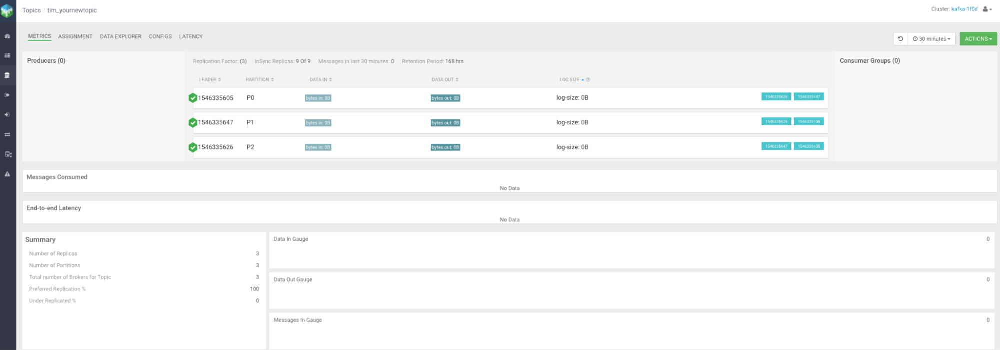

@import url('https://themes.googleusercontent.com/fonts/css?kit=dpiI8CyVsrzWsJLBFKehGpLhv3qFjX7dUn1mYxfCXhI');ol.lst-kix\_32047z63b3z0-8{list-style-type:none}.lst-kix\_qj2ht66i2gc4-8>li{counter-increment:lst-ctn-kix\_qj2ht66i2gc4-8}ol.lst-kix\_32047z63b3z0-7{list-style-type:none}ol.lst-kix\_32047z63b3z0-6{list-style-type:none}ol.lst-kix\_qj2ht66i2gc4-1.start{counter-reset:lst-ctn-kix\_qj2ht66i2gc4-1 0}ol.lst-kix\_32047z63b3z0-5{list-style-type:none}ol.lst-kix\_rt0tl7db1uip-4.start{counter-reset:lst-ctn-kix\_rt0tl7db1uip-4 0}ol.lst-kix\_32047z63b3z0-0{list-style-type:none}ol.lst-kix\_jmqnbqvn65kx-6{list-style-type:none}ol.lst-kix\_jmqnbqvn65kx-7{list-style-type:none}ol.lst-kix\_jmqnbqvn65kx-4{list-style-type:none}.lst-kix\_n5jgpog97swr-0>li{counter-increment:lst-ctn-kix\_n5jgpog97swr-0}ol.lst-kix\_jmqnbqvn65kx-5{list-style-type:none}ol.lst-kix\_32047z63b3z0-4{list-style-type:none}ol.lst-kix\_32047z63b3z0-3{list-style-type:none}ol.lst-kix\_32047z63b3z0-2{list-style-type:none}ol.lst-kix\_jmqnbqvn65kx-8{list-style-type:none}ol.lst-kix\_32047z63b3z0-1{list-style-type:none}ol.lst-kix\_n5jgpog97swr-8.start{counter-reset:lst-ctn-kix\_n5jgpog97swr-8 0}ol.lst-kix\_jmqnbqvn65kx-2{list-style-type:none}ol.lst-kix\_jmqnbqvn65kx-3{list-style-type:none}.lst-kix\_81zrf81fmc6s-5>li{counter-increment:lst-ctn-kix\_81zrf81fmc6s-5}ol.lst-kix\_jmqnbqvn65kx-0{list-style-type:none}ol.lst-kix\_jmqnbqvn65kx-1{list-style-type:none}.lst-kix\_s3463zks5s72-2>li{counter-increment:lst-ctn-kix\_s3463zks5s72-2}.lst-kix\_vu5qx56s2359-3>li{counter-increment:lst-ctn-kix\_vu5qx56s2359-3}.lst-kix\_rt0tl7db1uip-3>li{counter-increment:lst-ctn-kix\_rt0tl7db1uip-3}ol.lst-kix\_n5jgpog97swr-3.start{counter-reset:lst-ctn-kix\_n5jgpog97swr-3 0}.lst-kix\_guwkcucbsjiu-4>li{counter-increment:lst-ctn-kix\_guwkcucbsjiu-4}ol.lst-kix\_qbuf09hr6o7r-8.start{counter-reset:lst-ctn-kix\_qbuf09hr6o7r-8 0}ol.lst-kix\_l9z875t3yysd-4.start{counter-reset:lst-ctn-kix\_l9z875t3yysd-4 0}.lst-kix\_6sxqehc5c0at-3>li{counter-increment:lst-ctn-kix\_6sxqehc5c0at-3}ol.lst-kix\_s3463zks5s72-1.start{counter-reset:lst-ctn-kix\_s3463zks5s72-1 0}ol.lst-kix\_khu582ril6w2-7{list-style-type:none}ol.lst-kix\_khu582ril6w2-6{list-style-type:none}ol.lst-kix\_khu582ril6w2-5{list-style-type:none}.lst-kix\_sp88a3kgcpd2-4>li{counter-increment:lst-ctn-kix\_sp88a3kgcpd2-4}ol.lst-kix\_khu582ril6w2-4{list-style-type:none}.lst-kix\_5gk0q5v8abe8-7>li{counter-increment:lst-ctn-kix\_5gk0q5v8abe8-7}ol.lst-kix\_khu582ril6w2-8{list-style-type:none}ol.lst-kix\_frps9dlv20sa-5.start{counter-reset:lst-ctn-kix\_frps9dlv20sa-5 0}ol.lst-kix\_5gk0q5v8abe8-5.start{counter-reset:lst-ctn-kix\_5gk0q5v8abe8-5 0}ol.lst-kix\_32047z63b3z0-2.start{counter-reset:lst-ctn-kix\_32047z63b3z0-2 0}.lst-kix\_kceyv38ozlip-8>li{counter-increment:lst-ctn-kix\_kceyv38ozlip-8}ol.lst-kix\_khu582ril6w2-3{list-style-type:none}ol.lst-kix\_khu582ril6w2-2{list-style-type:none}ol.lst-kix\_khu582ril6w2-1{list-style-type:none}ol.lst-kix\_khu582ril6w2-0{list-style-type:none}.lst-kix\_stinsptlokkm-5>li{counter-increment:lst-ctn-kix\_stinsptlokkm-5}ul.lst-kix\_ra16qcyus3lk-8{list-style-type:none}.lst-kix\_32047z63b3z0-7>li{counter-increment:lst-ctn-kix\_32047z63b3z0-7}ul.lst-kix\_ra16qcyus3lk-7{list-style-type:none}ul.lst-kix\_ra16qcyus3lk-6{list-style-type:none}ol.lst-kix\_mofs5q4nlto1-4.start{counter-reset:lst-ctn-kix\_mofs5q4nlto1-4 0}.lst-kix\_4i75k0a0mzmz-1>li{counter-increment:lst-ctn-kix\_4i75k0a0mzmz-1}ul.lst-kix\_ra16qcyus3lk-5{list-style-type:none}ul.lst-kix\_ra16qcyus3lk-4{list-style-type:none}ul.lst-kix\_ra16qcyus3lk-3{list-style-type:none}ol.lst-kix\_5gk0q5v8abe8-0.start{counter-reset:lst-ctn-kix\_5gk0q5v8abe8-0 0}ul.lst-kix\_ra16qcyus3lk-2{list-style-type:none}ol.lst-kix\_frps9dlv20sa-0.start{counter-reset:lst-ctn-kix\_frps9dlv20sa-0 0}ul.lst-kix\_ra16qcyus3lk-1{list-style-type:none}ul.lst-kix\_ra16qcyus3lk-0{list-style-type:none}ul.lst-kix\_cyqgt9fva588-3{list-style-type:none}ul.lst-kix\_cyqgt9fva588-2{list-style-type:none}ul.lst-kix\_cyqgt9fva588-1{list-style-type:none}ul.lst-kix\_cyqgt9fva588-0{list-style-type:none}ol.lst-kix\_qbuf09hr6o7r-3.start{counter-reset:lst-ctn-kix\_qbuf09hr6o7r-3 0}ol.lst-kix\_vu5qx56s2359-5.start{counter-reset:lst-ctn-kix\_vu5qx56s2359-5 0}ul.lst-kix\_cyqgt9fva588-8{list-style-type:none}ol.lst-kix\_s3463zks5s72-6.start{counter-reset:lst-ctn-kix\_s3463zks5s72-6 0}ul.lst-kix\_cyqgt9fva588-7{list-style-type:none}ul.lst-kix\_cyqgt9fva588-6{list-style-type:none}ul.lst-kix\_cyqgt9fva588-5{list-style-type:none}ul.lst-kix\_cyqgt9fva588-4{list-style-type:none}.lst-kix\_4i75k0a0mzmz-8>li:before{content:"" counter(lst-ctn-kix\_4i75k0a0mzmz-8,lower-roman) ". "}.lst-kix\_81zrf81fmc6s-1>li:before{content:"" counter(lst-ctn-kix\_81zrf81fmc6s-1,lower-latin) ". "}.lst-kix\_xa4flfr3jfa-2>li{counter-increment:lst-ctn-kix\_xa4flfr3jfa-2}.lst-kix\_mofs5q4nlto1-2>li{counter-increment:lst-ctn-kix\_mofs5q4nlto1-2}ol.lst-kix\_sp88a3kgcpd2-7.start{counter-reset:lst-ctn-kix\_sp88a3kgcpd2-7 0}.lst-kix\_4i75k0a0mzmz-6>li:before{content:"" counter(lst-ctn-kix\_4i75k0a0mzmz-6,decimal) ". "}.lst-kix\_6sxqehc5c0at-0>li:before{content:"" counter(lst-ctn-kix\_6sxqehc5c0at-0,decimal) ". "}.lst-kix\_81zrf81fmc6s-5>li:before{content:"" counter(lst-ctn-kix\_81zrf81fmc6s-5,lower-roman) ". "}.lst-kix\_khu582ril6w2-0>li:before{content:"" counter(lst-ctn-kix\_khu582ril6w2-0,decimal) ". "}.lst-kix\_81zrf81fmc6s-7>li:before{content:"" counter(lst-ctn-kix\_81zrf81fmc6s-7,lower-latin) ". "}.lst-kix\_frps9dlv20sa-3>li{counter-increment:lst-ctn-kix\_frps9dlv20sa-3}ol.lst-kix\_6sxqehc5c0at-0.start{counter-reset:lst-ctn-kix\_6sxqehc5c0at-0 0}.lst-kix\_4i75k0a0mzmz-0>li:before{content:"" counter(lst-ctn-kix\_4i75k0a0mzmz-0,decimal) ". "}.lst-kix\_6sxqehc5c0at-6>li:before{content:"" counter(lst-ctn-kix\_6sxqehc5c0at-6,decimal) ". "}.lst-kix\_khu582ril6w2-4>li:before{content:"" counter(lst-ctn-kix\_khu582ril6w2-4,lower-latin) ". "}.lst-kix\_en0gxuadwdwn-7>li:before{content:"\\0025cb "}.lst-kix\_4i75k0a0mzmz-2>li:before{content:"" counter(lst-ctn-kix\_4i75k0a0mzmz-2,lower-roman) ". "}.lst-kix\_6sxqehc5c0at-8>li:before{content:"" counter(lst-ctn-kix\_6sxqehc5c0at-8,lower-roman) ". "}.lst-kix\_khu582ril6w2-2>li:before{content:"" counter(lst-ctn-kix\_khu582ril6w2-2,lower-roman) ". "}.lst-kix\_khu582ril6w2-6>li:before{content:"" counter(lst-ctn-kix\_khu582ril6w2-6,decimal) ". "}.lst-kix\_xa4flfr3jfa-1>li{counter-increment:lst-ctn-kix\_xa4flfr3jfa-1}ol.lst-kix\_32047z63b3z0-7.start{counter-reset:lst-ctn-kix\_32047z63b3z0-7 0}.lst-kix\_4i75k0a0mzmz-4>li:before{content:"" counter(lst-ctn-kix\_4i75k0a0mzmz-4,lower-latin) ". "}.lst-kix\_xy362pooe1ag-6>li{counter-increment:lst-ctn-kix\_xy362pooe1ag-6}.lst-kix\_en0gxuadwdwn-5>li:before{content:"\\0025a0 "}.lst-kix\_khu582ril6w2-4>li{counter-increment:lst-ctn-kix\_khu582ril6w2-4}.lst-kix\_tieskbfz0eer-6>li:before{content:"" counter(lst-ctn-kix\_tieskbfz0eer-6,decimal) ". "}.lst-kix\_khu582ril6w2-8>li:before{content:"" counter(lst-ctn-kix\_khu582ril6w2-8,lower-roman) ". "}.lst-kix\_tieskbfz0eer-8>li:before{content:"" counter(lst-ctn-kix\_tieskbfz0eer-8,lower-roman) ". "}.lst-kix\_qj2ht66i2gc4-0>li{counter-increment:lst-ctn-kix\_qj2ht66i2gc4-0}.lst-kix\_kceyv38ozlip-1>li{counter-increment:lst-ctn-kix\_kceyv38ozlip-1}.lst-kix\_32047z63b3z0-0>li{counter-increment:lst-ctn-kix\_32047z63b3z0-0}.lst-kix\_6sxqehc5c0at-4>li:before{content:"" counter(lst-ctn-kix\_6sxqehc5c0at-4,lower-latin) ". "}ol.lst-kix\_jmqnbqvn65kx-1.start{counter-reset:lst-ctn-kix\_jmqnbqvn65kx-1 0}ol.lst-kix\_khu582ril6w2-0.start{counter-reset:lst-ctn-kix\_khu582ril6w2-0 0}.lst-kix\_6sxqehc5c0at-2>li:before{content:"" counter(lst-ctn-kix\_6sxqehc5c0at-2,lower-roman) ". "}.lst-kix\_81zrf81fmc6s-3>li:before{content:"" counter(lst-ctn-kix\_81zrf81fmc6s-3,decimal) ". "}.lst-kix\_l9z875t3yysd-5>li{counter-increment:lst-ctn-kix\_l9z875t3yysd-5}.lst-kix\_n5jgpog97swr-7>li{counter-increment:lst-ctn-kix\_n5jgpog97swr-7}.lst-kix\_iciud360rv1u-5>li:before{content:"\\0025a0 "}.lst-kix\_l9z875t3yysd-6>li{counter-increment:lst-ctn-kix\_l9z875t3yysd-6}.lst-kix\_4i75k0a0mzmz-2>li{counter-increment:lst-ctn-kix\_4i75k0a0mzmz-2}ol.lst-kix\_qj2ht66i2gc4-6.start{counter-reset:lst-ctn-kix\_qj2ht66i2gc4-6 0}ul.lst-kix\_guwkcucbsjiu-0{list-style-type:none}.lst-kix\_iciud360rv1u-1>li:before{content:"\\0025cb "}.lst-kix\_iciud360rv1u-3>li:before{content:"\\0025cf "}.lst-kix\_tieskbfz0eer-0>li:before{content:"" counter(lst-ctn-kix\_tieskbfz0eer-0,decimal) ". "}.lst-kix\_tieskbfz0eer-2>li:before{content:"" counter(lst-ctn-kix\_tieskbfz0eer-2,lower-roman) ". "}.lst-kix\_stinsptlokkm-5>li:before{content:"(" counter(lst-ctn-kix\_stinsptlokkm-5,lower-roman) ") "}.lst-kix\_stinsptlokkm-1>li:before{content:"" counter(lst-ctn-kix\_stinsptlokkm-1,lower-latin) ") "}.lst-kix\_stinsptlokkm-3>li:before{content:"(" counter(lst-ctn-kix\_stinsptlokkm-3,decimal) ") "}.lst-kix\_iciud360rv1u-7>li:before{content:"\\0025cb "}.lst-kix\_tieskbfz0eer-4>li:before{content:"" counter(lst-ctn-kix\_tieskbfz0eer-4,lower-latin) ". "}.lst-kix\_stinsptlokkm-4>li{counter-increment:lst-ctn-kix\_stinsptlokkm-4}.lst-kix\_oahvhwdsoko8-4>li{counter-increment:lst-ctn-kix\_oahvhwdsoko8-4}ol.lst-kix\_stinsptlokkm-6.start{counter-reset:lst-ctn-kix\_stinsptlokkm-6 0}ul.lst-kix\_kb6x2l43ii8i-8{list-style-type:none}.lst-kix\_en0gxuadwdwn-1>li:before{content:"\\0025cb "}ul.lst-kix\_kb6x2l43ii8i-6{list-style-type:none}ul.lst-kix\_kb6x2l43ii8i-7{list-style-type:none}ol.lst-kix\_kceyv38ozlip-5.start{counter-reset:lst-ctn-kix\_kceyv38ozlip-5 0}.lst-kix\_n5jgpog97swr-8>li{counter-increment:lst-ctn-kix\_n5jgpog97swr-8}ul.lst-kix\_kb6x2l43ii8i-0{list-style-type:none}ul.lst-kix\_kb6x2l43ii8i-1{list-style-type:none}.lst-kix\_en0gxuadwdwn-3>li:before{content:"\\0025cf "}ol.lst-kix\_i13yrux4k4g-2.start{counter-reset:lst-ctn-kix\_i13yrux4k4g-2 0}ul.lst-kix\_kb6x2l43ii8i-4{list-style-type:none}ul.lst-kix\_kb6x2l43ii8i-5{list-style-type:none}ul.lst-kix\_kb6x2l43ii8i-2{list-style-type:none}.lst-kix\_sp88a3kgcpd2-5>li{counter-increment:lst-ctn-kix\_sp88a3kgcpd2-5}ul.lst-kix\_kb6x2l43ii8i-3{list-style-type:none}ol.lst-kix\_oahvhwdsoko8-5.start{counter-reset:lst-ctn-kix\_oahvhwdsoko8-5 0}.lst-kix\_stinsptlokkm-7>li:before{content:"" counter(lst-ctn-kix\_stinsptlokkm-7,lower-latin) ". "}.lst-kix\_jmqnbqvn65kx-4>li{counter-increment:lst-ctn-kix\_jmqnbqvn65kx-4}.lst-kix\_frps9dlv20sa-4>li{counter-increment:lst-ctn-kix\_frps9dlv20sa-4}.lst-kix\_kceyv38ozlip-0>li{counter-increment:lst-ctn-kix\_kceyv38ozlip-0}.lst-kix\_tieskbfz0eer-6>li{counter-increment:lst-ctn-kix\_tieskbfz0eer-6}ol.lst-kix\_xy362pooe1ag-3.start{counter-reset:lst-ctn-kix\_xy362pooe1ag-3 0}.lst-kix\_xa4flfr3jfa-8>li{counter-increment:lst-ctn-kix\_xa4flfr3jfa-8}.lst-kix\_s3463zks5s72-3>li{counter-increment:lst-ctn-kix\_s3463zks5s72-3}ol.lst-kix\_4i75k0a0mzmz-6.start{counter-reset:lst-ctn-kix\_4i75k0a0mzmz-6 0}ol.lst-kix\_guwkcucbsjiu-1.start{counter-reset:lst-ctn-kix\_guwkcucbsjiu-1 0}.lst-kix\_oahvhwdsoko8-3>li:before{content:"" counter(lst-ctn-kix\_oahvhwdsoko8-3,decimal) ". "}ol.lst-kix\_jmqnbqvn65kx-5.start{counter-reset:lst-ctn-kix\_jmqnbqvn65kx-5 0}.lst-kix\_oahvhwdsoko8-2>li:before{content:"" counter(lst-ctn-kix\_oahvhwdsoko8-2,lower-roman) ". "}.lst-kix\_32047z63b3z0-5>li:before{content:"" counter(lst-ctn-kix\_32047z63b3z0-5,lower-roman) ". "}.lst-kix\_xy362pooe1ag-0>li{counter-increment:lst-ctn-kix\_xy362pooe1ag-0}ol.lst-kix\_s3463zks5s72-2{list-style-type:none}ol.lst-kix\_s3463zks5s72-1{list-style-type:none}ol.lst-kix\_s3463zks5s72-4{list-style-type:none}ol.lst-kix\_s3463zks5s72-3{list-style-type:none}.lst-kix\_32047z63b3z0-2>li:before{content:"" counter(lst-ctn-kix\_32047z63b3z0-2,lower-roman) ". "}ol.lst-kix\_tieskbfz0eer-1.start{counter-reset:lst-ctn-kix\_tieskbfz0eer-1 0}ol.lst-kix\_s3463zks5s72-0{list-style-type:none}.lst-kix\_qj2ht66i2gc4-7>li{counter-increment:lst-ctn-kix\_qj2ht66i2gc4-7}ol.lst-kix\_s3463zks5s72-6{list-style-type:none}ol.lst-kix\_s3463zks5s72-5{list-style-type:none}.lst-kix\_32047z63b3z0-1>li:before{content:"" counter(lst-ctn-kix\_32047z63b3z0-1,lower-latin) ". "}ol.lst-kix\_s3463zks5s72-8{list-style-type:none}ol.lst-kix\_s3463zks5s72-7{list-style-type:none}.lst-kix\_l9z875t3yysd-1>li:before{content:"" counter(lst-ctn-kix\_l9z875t3yysd-1,lower-latin) ". "}.lst-kix\_jmqnbqvn65kx-5>li{counter-increment:lst-ctn-kix\_jmqnbqvn65kx-5}ol.lst-kix\_4i75k0a0mzmz-0.start{counter-reset:lst-ctn-kix\_4i75k0a0mzmz-0 0}.lst-kix\_qbuf09hr6o7r-7>li:before{content:"" counter(lst-ctn-kix\_qbuf09hr6o7r-7,lower-latin) ". "}.lst-kix\_l9z875t3yysd-6>li:before{content:"" counter(lst-ctn-kix\_l9z875t3yysd-6,decimal) ". "}.lst-kix\_qbuf09hr6o7r-8>li:before{content:"" counter(lst-ctn-kix\_qbuf09hr6o7r-8,lower-roman) ". "}.lst-kix\_ragvn9j3gr73-8>li:before{content:"\\0025a0 "}ol.lst-kix\_i13yrux4k4g-3.start{counter-reset:lst-ctn-kix\_i13yrux4k4g-3 0}.lst-kix\_l9z875t3yysd-5>li:before{content:"" counter(lst-ctn-kix\_l9z875t3yysd-5,lower-roman) ". "}.lst-kix\_kceyv38ozlip-7>li{counter-increment:lst-ctn-kix\_kceyv38ozlip-7}.lst-kix\_l9z875t3yysd-2>li:before{content:"" counter(lst-ctn-kix\_l9z875t3yysd-2,lower-roman) ". "}ol.lst-kix\_xa4flfr3jfa-8.start{counter-reset:lst-ctn-kix\_xa4flfr3jfa-8 0}.lst-kix\_4i75k0a0mzmz-8>li{counter-increment:lst-ctn-kix\_4i75k0a0mzmz-8}.lst-kix\_ragvn9j3gr73-0>li:before{content:"\\0025cf "}.lst-kix\_ragvn9j3gr73-1>li:before{content:"\\0025cb "}.lst-kix\_frps9dlv20sa-0>li:before{content:"" counter(lst-ctn-kix\_frps9dlv20sa-0,decimal) ") "}.lst-kix\_frps9dlv20sa-1>li:before{content:"" counter(lst-ctn-kix\_frps9dlv20sa-1,lower-latin) ") "}.lst-kix\_oahvhwdsoko8-3>li{counter-increment:lst-ctn-kix\_oahvhwdsoko8-3}.lst-kix\_frps9dlv20sa-5>li:before{content:"(" counter(lst-ctn-kix\_frps9dlv20sa-5,lower-roman) ") "}.lst-kix\_h8whphf3ejp-5>li:before{content:"\\0025a0 "}.lst-kix\_ragvn9j3gr73-5>li:before{content:"\\0025a0 "}.lst-kix\_frps9dlv20sa-4>li:before{content:"(" counter(lst-ctn-kix\_frps9dlv20sa-4,lower-latin) ") "}.lst-kix\_frps9dlv20sa-8>li:before{content:"" counter(lst-ctn-kix\_frps9dlv20sa-8,lower-roman) ". "}.lst-kix\_tieskbfz0eer-7>li{counter-increment:lst-ctn-kix\_tieskbfz0eer-7}.lst-kix\_guwkcucbsjiu-0>li:before{content:"\\0025cf "}.lst-kix\_qbuf09hr6o7r-3>li:before{content:"" counter(lst-ctn-kix\_qbuf09hr6o7r-3,decimal) ". "}.lst-kix\_5gk0q5v8abe8-0>li{counter-increment:lst-ctn-kix\_5gk0q5v8abe8-0}.lst-kix\_qbuf09hr6o7r-4>li:before{content:"" counter(lst-ctn-kix\_qbuf09hr6o7r-4,lower-latin) ". "}.lst-kix\_ragvn9j3gr73-4>li:before{content:"\\0025cb "}ol.lst-kix\_l9z875t3yysd-0.start{counter-reset:lst-ctn-kix\_l9z875t3yysd-0 0}.lst-kix\_h8whphf3ejp-8>li:before{content:"\\0025a0 "}.lst-kix\_guwkcucbsjiu-4>li:before{content:"" counter(lst-ctn-kix\_guwkcucbsjiu-4,lower-latin) ". "}.lst-kix\_xy362pooe1ag-7>li{counter-increment:lst-ctn-kix\_xy362pooe1ag-7}.lst-kix\_qbuf09hr6o7r-0>li:before{content:"" counter(lst-ctn-kix\_qbuf09hr6o7r-0,decimal) ". "}.lst-kix\_7a557mc08o8r-4>li:before{content:"- "}ol.lst-kix\_81zrf81fmc6s-8.start{counter-reset:lst-ctn-kix\_81zrf81fmc6s-8 0}.lst-kix\_h8whphf3ejp-1>li:before{content:"\\0025cb "}.lst-kix\_guwkcucbsjiu-1>li:before{content:"" counter(lst-ctn-kix\_guwkcucbsjiu-1,lower-latin) ". "}.lst-kix\_guwkcucbsjiu-5>li:before{content:"" counter(lst-ctn-kix\_guwkcucbsjiu-5,lower-roman) ". "}.lst-kix\_sp88a3kgcpd2-3>li{counter-increment:lst-ctn-kix\_sp88a3kgcpd2-3}.lst-kix\_mofs5q4nlto1-3>li{counter-increment:lst-ctn-kix\_mofs5q4nlto1-3}.lst-kix\_7a557mc08o8r-0>li:before{content:"- "}.lst-kix\_7a557mc08o8r-8>li:before{content:"- "}ol.lst-kix\_tieskbfz0eer-2.start{counter-reset:lst-ctn-kix\_tieskbfz0eer-2 0}.lst-kix\_h8whphf3ejp-4>li:before{content:"\\0025cb "}.lst-kix\_7a557mc08o8r-7>li:before{content:"- "}ol.lst-kix\_jmqnbqvn65kx-6.start{counter-reset:lst-ctn-kix\_jmqnbqvn65kx-6 0}ol.lst-kix\_frps9dlv20sa-6.start{counter-reset:lst-ctn-kix\_frps9dlv20sa-6 0}.lst-kix\_guwkcucbsjiu-8>li:before{content:"" counter(lst-ctn-kix\_guwkcucbsjiu-8,lower-roman) ". "}ol.lst-kix\_4i75k0a0mzmz-5.start{counter-reset:lst-ctn-kix\_4i75k0a0mzmz-5 0}.lst-kix\_h8whphf3ejp-0>li:before{content:"\\0025cf "}.lst-kix\_7a557mc08o8r-3>li:before{content:"- "}.lst-kix\_81zrf81fmc6s-0>li:before{content:"" counter(lst-ctn-kix\_81zrf81fmc6s-0,decimal) ". "}.lst-kix\_qj2ht66i2gc4-2>li{counter-increment:lst-ctn-kix\_qj2ht66i2gc4-2}ol.lst-kix\_mofs5q4nlto1-8.start{counter-reset:lst-ctn-kix\_mofs5q4nlto1-8 0}.lst-kix\_4i75k0a0mzmz-5>li:before{content:"" counter(lst-ctn-kix\_4i75k0a0mzmz-5,lower-roman) ". "}ol.lst-kix\_n5jgpog97swr-4.start{counter-reset:lst-ctn-kix\_n5jgpog97swr-4 0}.lst-kix\_khu582ril6w2-1>li:before{content:"" counter(lst-ctn-kix\_khu582ril6w2-1,lower-latin) ". "}ol.lst-kix\_mofs5q4nlto1-5.start{counter-reset:lst-ctn-kix\_mofs5q4nlto1-5 0}.lst-kix\_en0gxuadwdwn-8>li:before{content:"\\0025a0 "}.lst-kix\_81zrf81fmc6s-8>li:before{content:"" counter(lst-ctn-kix\_81zrf81fmc6s-8,lower-roman) ". "}.lst-kix\_khu582ril6w2-5>li:before{content:"" counter(lst-ctn-kix\_khu582ril6w2-5,lower-roman) ". "}ul.lst-kix\_en0gxuadwdwn-8{list-style-type:none}ol.lst-kix\_guwkcucbsjiu-5.start{counter-reset:lst-ctn-kix\_guwkcucbsjiu-5 0}.lst-kix\_i13yrux4k4g-7>li:before{content:"" counter(lst-ctn-kix\_i13yrux4k4g-7,lower-latin) ". "}ul.lst-kix\_en0gxuadwdwn-7{list-style-type:none}.lst-kix\_4i75k0a0mzmz-1>li:before{content:"" counter(lst-ctn-kix\_4i75k0a0mzmz-1,lower-latin) ". "}.lst-kix\_6sxqehc5c0at-7>li:before{content:"" counter(lst-ctn-kix\_6sxqehc5c0at-7,lower-latin) ". "}ul.lst-kix\_en0gxuadwdwn-6{list-style-type:none}ul.lst-kix\_en0gxuadwdwn-5{list-style-type:none}.lst-kix\_en0gxuadwdwn-4>li:before{content:"\\0025cb "}ul.lst-kix\_en0gxuadwdwn-4{list-style-type:none}ul.lst-kix\_en0gxuadwdwn-3{list-style-type:none}.lst-kix\_i13yrux4k4g-0>li{counter-increment:lst-ctn-kix\_i13yrux4k4g-0}ul.lst-kix\_en0gxuadwdwn-2{list-style-type:none}ul.lst-kix\_en0gxuadwdwn-1{list-style-type:none}ul.lst-kix\_en0gxuadwdwn-0{list-style-type:none}ol.lst-kix\_qj2ht66i2gc4-0.start{counter-reset:lst-ctn-kix\_qj2ht66i2gc4-0 0}ol.lst-kix\_rt0tl7db1uip-3.start{counter-reset:lst-ctn-kix\_rt0tl7db1uip-3 0}.lst-kix\_qbuf09hr6o7r-3>li{counter-increment:lst-ctn-kix\_qbuf09hr6o7r-3}ol.lst-kix\_i13yrux4k4g-7.start{counter-reset:lst-ctn-kix\_i13yrux4k4g-7 0}.lst-kix\_i13yrux4k4g-2>li{counter-increment:lst-ctn-kix\_i13yrux4k4g-2}.lst-kix\_xa4flfr3jfa-3>li{counter-increment:lst-ctn-kix\_xa4flfr3jfa-3}ul.lst-kix\_30pqwzapyw2h-4{list-style-type:none}ul.lst-kix\_30pqwzapyw2h-3{list-style-type:none}ol.lst-kix\_rt0tl7db1uip-0.start{counter-reset:lst-ctn-kix\_rt0tl7db1uip-0 0}ul.lst-kix\_30pqwzapyw2h-2{list-style-type:none}ul.lst-kix\_30pqwzapyw2h-1{list-style-type:none}ul.lst-kix\_30pqwzapyw2h-0{list-style-type:none}.lst-kix\_i13yrux4k4g-3>li:before{content:"" counter(lst-ctn-kix\_i13yrux4k4g-3,decimal) ". "}ul.lst-kix\_qjmr709sgz3d-0{list-style-type:none}ul.lst-kix\_qjmr709sgz3d-1{list-style-type:none}.lst-kix\_6sxqehc5c0at-3>li:before{content:"" counter(lst-ctn-kix\_6sxqehc5c0at-3,decimal) ". "}ul.lst-kix\_qjmr709sgz3d-2{list-style-type:none}.lst-kix\_stinsptlokkm-6>li{counter-increment:lst-ctn-kix\_stinsptlokkm-6}ul.lst-kix\_qjmr709sgz3d-3{list-style-type:none}ul.lst-kix\_qjmr709sgz3d-4{list-style-type:none}ul.lst-kix\_qjmr709sgz3d-5{list-style-type:none}.lst-kix\_81zrf81fmc6s-4>li:before{content:"" counter(lst-ctn-kix\_81zrf81fmc6s-4,lower-latin) ". "}ul.lst-kix\_qjmr709sgz3d-6{list-style-type:none}ul.lst-kix\_qjmr709sgz3d-7{list-style-type:none}ol.lst-kix\_32047z63b3z0-1.start{counter-reset:lst-ctn-kix\_32047z63b3z0-1 0}ul.lst-kix\_30pqwzapyw2h-8{list-style-type:none}ul.lst-kix\_qjmr709sgz3d-8{list-style-type:none}ul.lst-kix\_30pqwzapyw2h-7{list-style-type:none}ul.lst-kix\_30pqwzapyw2h-6{list-style-type:none}ul.lst-kix\_30pqwzapyw2h-5{list-style-type:none}.lst-kix\_iciud360rv1u-4>li:before{content:"\\0025cb "}.lst-kix\_rt0tl7db1uip-3>li:before{content:"" counter(lst-ctn-kix\_rt0tl7db1uip-3,decimal) ". "}.lst-kix\_rt0tl7db1uip-7>li:before{content:"" counter(lst-ctn-kix\_rt0tl7db1uip-7,lower-latin) ". "}ol.lst-kix\_guwkcucbsjiu-6.start{counter-reset:lst-ctn-kix\_guwkcucbsjiu-6 0}.lst-kix\_stinsptlokkm-6>li:before{content:"" counter(lst-ctn-kix\_stinsptlokkm-6,decimal) ". "}ol.lst-kix\_n5jgpog97swr-2.start{counter-reset:lst-ctn-kix\_n5jgpog97swr-2 0}.lst-kix\_tieskbfz0eer-1>li:before{content:"" counter(lst-ctn-kix\_tieskbfz0eer-1,lower-latin) ". "}.lst-kix\_khu582ril6w2-2>li{counter-increment:lst-ctn-kix\_khu582ril6w2-2}.lst-kix\_stinsptlokkm-2>li:before{content:"" counter(lst-ctn-kix\_stinsptlokkm-2,lower-roman) ") "}.lst-kix\_iciud360rv1u-8>li:before{content:"\\0025a0 "}.lst-kix\_tieskbfz0eer-5>li:before{content:"" counter(lst-ctn-kix\_tieskbfz0eer-5,lower-roman) ". "}ol.lst-kix\_4i75k0a0mzmz-1.start{counter-reset:lst-ctn-kix\_4i75k0a0mzmz-1 0}ol.lst-kix\_xa4flfr3jfa-4.start{counter-reset:lst-ctn-kix\_xa4flfr3jfa-4 0}.lst-kix\_en0gxuadwdwn-0>li:before{content:"\\0025cf "}ol.lst-kix\_xa4flfr3jfa-3.start{counter-reset:lst-ctn-kix\_xa4flfr3jfa-3 0}.lst-kix\_iciud360rv1u-0>li:before{content:"\\0025cf "}.lst-kix\_5gk0q5v8abe8-5>li{counter-increment:lst-ctn-kix\_5gk0q5v8abe8-5}.lst-kix\_oahvhwdsoko8-6>li:before{content:"" counter(lst-ctn-kix\_oahvhwdsoko8-6,decimal) ". "}ol.lst-kix\_i13yrux4k4g-8.start{counter-reset:lst-ctn-kix\_i13yrux4k4g-8 0}ol.lst-kix\_6sxqehc5c0at-2{list-style-type:none}ol.lst-kix\_6sxqehc5c0at-3{list-style-type:none}ol.lst-kix\_6sxqehc5c0at-0{list-style-type:none}.lst-kix\_oahvhwdsoko8-6>li{counter-increment:lst-ctn-kix\_oahvhwdsoko8-6}ol.lst-kix\_6sxqehc5c0at-1{list-style-type:none}ol.lst-kix\_6sxqehc5c0at-6{list-style-type:none}ul.lst-kix\_ragvn9j3gr73-6{list-style-type:none}ol.lst-kix\_6sxqehc5c0at-7{list-style-type:none}ul.lst-kix\_ragvn9j3gr73-7{list-style-type:none}ol.lst-kix\_6sxqehc5c0at-4{list-style-type:none}.lst-kix\_mofs5q4nlto1-8>li{counter-increment:lst-ctn-kix\_mofs5q4nlto1-8}ul.lst-kix\_ragvn9j3gr73-4{list-style-type:none}ol.lst-kix\_6sxqehc5c0at-5{list-style-type:none}ul.lst-kix\_ragvn9j3gr73-5{list-style-type:none}ul.lst-kix\_ragvn9j3gr73-2{list-style-type:none}ul.lst-kix\_ragvn9j3gr73-3{list-style-type:none}ol.lst-kix\_6sxqehc5c0at-8{list-style-type:none}.lst-kix\_i13yrux4k4g-7>li{counter-increment:lst-ctn-kix\_i13yrux4k4g-7}ul.lst-kix\_ragvn9j3gr73-0{list-style-type:none}.lst-kix\_32047z63b3z0-5>li{counter-increment:lst-ctn-kix\_32047z63b3z0-5}ul.lst-kix\_ragvn9j3gr73-1{list-style-type:none}ul.lst-kix\_e0n37vkdj4pt-4{list-style-type:none}ul.lst-kix\_e0n37vkdj4pt-3{list-style-type:none}ul.lst-kix\_e0n37vkdj4pt-6{list-style-type:none}.lst-kix\_jmqnbqvn65kx-0>li:before{content:"" counter(lst-ctn-kix\_jmqnbqvn65kx-0,decimal) ". "}.lst-kix\_jmqnbqvn65kx-2>li:before{content:"" counter(lst-ctn-kix\_jmqnbqvn65kx-2,lower-roman) ". "}ol.lst-kix\_sp88a3kgcpd2-3.start{counter-reset:lst-ctn-kix\_sp88a3kgcpd2-3 0}ul.lst-kix\_e0n37vkdj4pt-5{list-style-type:none}.lst-kix\_tieskbfz0eer-4>li{counter-increment:lst-ctn-kix\_tieskbfz0eer-4}ul.lst-kix\_e0n37vkdj4pt-8{list-style-type:none}ul.lst-kix\_e0n37vkdj4pt-7{list-style-type:none}.lst-kix\_sp88a3kgcpd2-6>li{counter-increment:lst-ctn-kix\_sp88a3kgcpd2-6}ul.lst-kix\_e0n37vkdj4pt-0{list-style-type:none}ol.lst-kix\_khu582ril6w2-1.start{counter-reset:lst-ctn-kix\_khu582ril6w2-1 0}.lst-kix\_jmqnbqvn65kx-3>li:before{content:"" counter(lst-ctn-kix\_jmqnbqvn65kx-3,decimal) ". "}ol.lst-kix\_qj2ht66i2gc4-7.start{counter-reset:lst-ctn-kix\_qj2ht66i2gc4-7 0}ul.lst-kix\_e0n37vkdj4pt-2{list-style-type:none}ul.lst-kix\_e0n37vkdj4pt-1{list-style-type:none}.lst-kix\_jmqnbqvn65kx-8>li:before{content:"" counter(lst-ctn-kix\_jmqnbqvn65kx-8,lower-roman) ". "}.lst-kix\_jmqnbqvn65kx-5>li:before{content:"" counter(lst-ctn-kix\_jmqnbqvn65kx-5,lower-roman) ". "}ol.lst-kix\_frps9dlv20sa-4.start{counter-reset:lst-ctn-kix\_frps9dlv20sa-4 0}.lst-kix\_g23xlj96ep8w-4>li:before{content:"\\0025cb "}.lst-kix\_g23xlj96ep8w-5>li:before{content:"\\0025a0 "}ol.lst-kix\_guwkcucbsjiu-4.start{counter-reset:lst-ctn-kix\_guwkcucbsjiu-4 0}.lst-kix\_kceyv38ozlip-1>li:before{content:"" counter(lst-ctn-kix\_kceyv38ozlip-1,lower-latin) ". "}.lst-kix\_kceyv38ozlip-3>li:before{content:"" counter(lst-ctn-kix\_kceyv38ozlip-3,decimal) ". "}.lst-kix\_qj2ht66i2gc4-6>li{counter-increment:lst-ctn-kix\_qj2ht66i2gc4-6}.lst-kix\_g23xlj96ep8w-2>li:before{content:"\\0025a0 "}ul.lst-kix\_ragvn9j3gr73-8{list-style-type:none}.lst-kix\_81zrf81fmc6s-3>li{counter-increment:lst-ctn-kix\_81zrf81fmc6s-3}.lst-kix\_s3463zks5s72-0>li{counter-increment:lst-ctn-kix\_s3463zks5s72-0}.lst-kix\_kceyv38ozlip-0>li:before{content:"" counter(lst-ctn-kix\_kceyv38ozlip-0,decimal) ". "}.lst-kix\_30pqwzapyw2h-8>li:before{content:"\\0025a0 "}ol.lst-kix\_5gk0q5v8abe8-1.start{counter-reset:lst-ctn-kix\_5gk0q5v8abe8-1 0}.lst-kix\_kceyv38ozlip-6>li:before{content:"" counter(lst-ctn-kix\_kceyv38ozlip-6,decimal) ". "}.lst-kix\_tieskbfz0eer-8>li{counter-increment:lst-ctn-kix\_tieskbfz0eer-8}.lst-kix\_30pqwzapyw2h-5>li:before{content:"\\0025a0 "}.lst-kix\_30pqwzapyw2h-7>li:before{content:"\\0025cb "}.lst-kix\_g23xlj96ep8w-7>li:before{content:"\\0025cb "}.lst-kix\_30pqwzapyw2h-2>li:before{content:"\\0025a0 "}ol.lst-kix\_s3463zks5s72-7.start{counter-reset:lst-ctn-kix\_s3463zks5s72-7 0}.lst-kix\_30pqwzapyw2h-0>li:before{content:"\\0025cf "}.lst-kix\_frps9dlv20sa-5>li{counter-increment:lst-ctn-kix\_frps9dlv20sa-5}ol.lst-kix\_s3463zks5s72-0.start{counter-reset:lst-ctn-kix\_s3463zks5s72-0 0}ol.lst-kix\_qj2ht66i2gc4-2.start{counter-reset:lst-ctn-kix\_qj2ht66i2gc4-2 0}ol.lst-kix\_khu582ril6w2-6.start{counter-reset:lst-ctn-kix\_khu582ril6w2-6 0}.lst-kix\_32047z63b3z0-1>li{counter-increment:lst-ctn-kix\_32047z63b3z0-1}.lst-kix\_i13yrux4k4g-3>li{counter-increment:lst-ctn-kix\_i13yrux4k4g-3}.lst-kix\_kceyv38ozlip-8>li:before{content:"" counter(lst-ctn-kix\_kceyv38ozlip-8,lower-roman) ". "}.lst-kix\_6sxqehc5c0at-1>li{counter-increment:lst-ctn-kix\_6sxqehc5c0at-1}ol.lst-kix\_xa4flfr3jfa-0.start{counter-reset:lst-ctn-kix\_xa4flfr3jfa-0 0}ol.lst-kix\_6sxqehc5c0at-1.start{counter-reset:lst-ctn-kix\_6sxqehc5c0at-1 0}.lst-kix\_l9z875t3yysd-7>li{counter-increment:lst-ctn-kix\_l9z875t3yysd-7}.lst-kix\_4i75k0a0mzmz-7>li{counter-increment:lst-ctn-kix\_4i75k0a0mzmz-7}.lst-kix\_xy362pooe1ag-1>li:before{content:"" counter(lst-ctn-kix\_xy362pooe1ag-1,lower-latin) ". "}.lst-kix\_s3463zks5s72-4>li{counter-increment:lst-ctn-kix\_s3463zks5s72-4}ol.lst-kix\_5gk0q5v8abe8-6.start{counter-reset:lst-ctn-kix\_5gk0q5v8abe8-6 0}.lst-kix\_xy362pooe1ag-6>li:before{content:"" counter(lst-ctn-kix\_xy362pooe1ag-6,decimal) ". "}.lst-kix\_xy362pooe1ag-4>li:before{content:"" counter(lst-ctn-kix\_xy362pooe1ag-4,lower-latin) ". "}.lst-kix\_qj2ht66i2gc4-8>li:before{content:"" counter(lst-ctn-kix\_qj2ht66i2gc4-8,lower-roman) ". "}.lst-kix\_qj2ht66i2gc4-0>li:before{content:"" counter(lst-ctn-kix\_qj2ht66i2gc4-0,decimal) ". "}.lst-kix\_qj2ht66i2gc4-2>li:before{content:"" counter(lst-ctn-kix\_qj2ht66i2gc4-2,lower-roman) ". "}.lst-kix\_xy362pooe1ag-7>li:before{content:"" counter(lst-ctn-kix\_xy362pooe1ag-7,lower-latin) ". "}.lst-kix\_s3463zks5s72-8>li{counter-increment:lst-ctn-kix\_s3463zks5s72-8}.lst-kix\_i13yrux4k4g-6>li:before{content:"" counter(lst-ctn-kix\_i13yrux4k4g-6,decimal) ". "}.lst-kix\_khu582ril6w2-5>li{counter-increment:lst-ctn-kix\_khu582ril6w2-5}.lst-kix\_mofs5q4nlto1-1>li{counter-increment:lst-ctn-kix\_mofs5q4nlto1-1}ol.lst-kix\_vu5qx56s2359-0{list-style-type:none}ol.lst-kix\_vu5qx56s2359-4{list-style-type:none}ol.lst-kix\_vu5qx56s2359-3{list-style-type:none}ol.lst-kix\_vu5qx56s2359-2{list-style-type:none}ol.lst-kix\_vu5qx56s2359-1{list-style-type:none}ol.lst-kix\_vu5qx56s2359-8{list-style-type:none}ol.lst-kix\_6sxqehc5c0at-8.start{counter-reset:lst-ctn-kix\_6sxqehc5c0at-8 0}ol.lst-kix\_vu5qx56s2359-7{list-style-type:none}ol.lst-kix\_5gk0q5v8abe8-4.start{counter-reset:lst-ctn-kix\_5gk0q5v8abe8-4 0}ol.lst-kix\_vu5qx56s2359-6{list-style-type:none}ol.lst-kix\_khu582ril6w2-3.start{counter-reset:lst-ctn-kix\_khu582ril6w2-3 0}ol.lst-kix\_vu5qx56s2359-5{list-style-type:none}ol.lst-kix\_mofs5q4nlto1-0.start{counter-reset:lst-ctn-kix\_mofs5q4nlto1-0 0}.lst-kix\_i13yrux4k4g-4>li:before{content:"" counter(lst-ctn-kix\_i13yrux4k4g-4,lower-latin) ". "}.lst-kix\_vu5qx56s2359-8>li{counter-increment:lst-ctn-kix\_vu5qx56s2359-8}ol.lst-kix\_mofs5q4nlto1-3.start{counter-reset:lst-ctn-kix\_mofs5q4nlto1-3 0}.lst-kix\_rt0tl7db1uip-2>li{counter-increment:lst-ctn-kix\_rt0tl7db1uip-2}.lst-kix\_guwkcucbsjiu-6>li{counter-increment:lst-ctn-kix\_guwkcucbsjiu-6}.lst-kix\_rt0tl7db1uip-2>li:before{content:"" counter(lst-ctn-kix\_rt0tl7db1uip-2,lower-roman) ". "}.lst-kix\_rt0tl7db1uip-0>li:before{content:"" counter(lst-ctn-kix\_rt0tl7db1uip-0,decimal) ". "}.lst-kix\_rt0tl7db1uip-8>li:before{content:"" counter(lst-ctn-kix\_rt0tl7db1uip-8,lower-roman) ". "}.lst-kix\_4i75k0a0mzmz-3>li{counter-increment:lst-ctn-kix\_4i75k0a0mzmz-3}.lst-kix\_l9z875t3yysd-8>li:before{content:"" counter(lst-ctn-kix\_l9z875t3yysd-8,lower-roman) ". "}ol.lst-kix\_sp88a3kgcpd2-8.start{counter-reset:lst-ctn-kix\_sp88a3kgcpd2-8 0}.lst-kix\_l9z875t3yysd-0>li{counter-increment:lst-ctn-kix\_l9z875t3yysd-0}.lst-kix\_vu5qx56s2359-1>li{counter-increment:lst-ctn-kix\_vu5qx56s2359-1}ol.lst-kix\_qj2ht66i2gc4-5.start{counter-reset:lst-ctn-kix\_qj2ht66i2gc4-5 0}ol.lst-kix\_n5jgpog97swr-7.start{counter-reset:lst-ctn-kix\_n5jgpog97swr-7 0}.lst-kix\_kceyv38ozlip-6>li{counter-increment:lst-ctn-kix\_kceyv38ozlip-6}.lst-kix\_oahvhwdsoko8-7>li:before{content:"" counter(lst-ctn-kix\_oahvhwdsoko8-7,lower-latin) ". "}ul.lst-kix\_iciud360rv1u-0{list-style-type:none}.lst-kix\_32047z63b3z0-6>li:before{content:"" counter(lst-ctn-kix\_32047z63b3z0-6,decimal) ". "}ul.lst-kix\_iciud360rv1u-1{list-style-type:none}ul.lst-kix\_iciud360rv1u-4{list-style-type:none}.lst-kix\_32047z63b3z0-8>li:before{content:"" counter(lst-ctn-kix\_32047z63b3z0-8,lower-roman) ". "}ul.lst-kix\_iciud360rv1u-5{list-style-type:none}ul.lst-kix\_iciud360rv1u-2{list-style-type:none}ul.lst-kix\_iciud360rv1u-3{list-style-type:none}ul.lst-kix\_iciud360rv1u-8{list-style-type:none}.lst-kix\_5gk0q5v8abe8-2>li{counter-increment:lst-ctn-kix\_5gk0q5v8abe8-2}ul.lst-kix\_iciud360rv1u-6{list-style-type:none}ul.lst-kix\_iciud360rv1u-7{list-style-type:none}ol.lst-kix\_sp88a3kgcpd2-0.start{counter-reset:lst-ctn-kix\_sp88a3kgcpd2-0 0}.lst-kix\_oahvhwdsoko8-1>li:before{content:"" counter(lst-ctn-kix\_oahvhwdsoko8-1,lower-latin) ". "}ol.lst-kix\_5gk0q5v8abe8-3.start{counter-reset:lst-ctn-kix\_5gk0q5v8abe8-3 0}.lst-kix\_oahvhwdsoko8-4>li:before{content:"" counter(lst-ctn-kix\_oahvhwdsoko8-4,lower-latin) ". "}.lst-kix\_qjmr709sgz3d-5>li:before{content:"\\0025a0 "}ol.lst-kix\_khu582ril6w2-4.start{counter-reset:lst-ctn-kix\_khu582ril6w2-4 0}ol.lst-kix\_mofs5q4nlto1-1.start{counter-reset:lst-ctn-kix\_mofs5q4nlto1-1 0}.lst-kix\_tieskbfz0eer-5>li{counter-increment:lst-ctn-kix\_tieskbfz0eer-5}.lst-kix\_52lq1c2p7838-6>li:before{content:"\\0025cf "}.lst-kix\_32047z63b3z0-3>li:before{content:"" counter(lst-ctn-kix\_32047z63b3z0-3,decimal) ". "}.lst-kix\_rt0tl7db1uip-6>li{counter-increment:lst-ctn-kix\_rt0tl7db1uip-6}.lst-kix\_32047z63b3z0-0>li:before{content:"" counter(lst-ctn-kix\_32047z63b3z0-0,decimal) ". "}.lst-kix\_i13yrux4k4g-6>li{counter-increment:lst-ctn-kix\_i13yrux4k4g-6}.lst-kix\_guwkcucbsjiu-3>li{counter-increment:lst-ctn-kix\_guwkcucbsjiu-3}.lst-kix\_52lq1c2p7838-3>li:before{content:"\\0025cf "}ol.lst-kix\_tieskbfz0eer-1{list-style-type:none}ol.lst-kix\_sp88a3kgcpd2-6.start{counter-reset:lst-ctn-kix\_sp88a3kgcpd2-6 0}ol.lst-kix\_tieskbfz0eer-2{list-style-type:none}.lst-kix\_l9z875t3yysd-0>li:before{content:"" counter(lst-ctn-kix\_l9z875t3yysd-0,decimal) ". "}ol.lst-kix\_kceyv38ozlip-0{list-style-type:none}ol.lst-kix\_tieskbfz0eer-0{list-style-type:none}ol.lst-kix\_kceyv38ozlip-1{list-style-type:none}ol.lst-kix\_frps9dlv20sa-2.start{counter-reset:lst-ctn-kix\_frps9dlv20sa-2 0}ol.lst-kix\_tieskbfz0eer-5{list-style-type:none}.lst-kix\_khu582ril6w2-1>li{counter-increment:lst-ctn-kix\_khu582ril6w2-1}ol.lst-kix\_kceyv38ozlip-2{list-style-type:none}ol.lst-kix\_tieskbfz0eer-6{list-style-type:none}ol.lst-kix\_kceyv38ozlip-3{list-style-type:none}ol.lst-kix\_tieskbfz0eer-3{list-style-type:none}ol.lst-kix\_kceyv38ozlip-4{list-style-type:none}ol.lst-kix\_tieskbfz0eer-4{list-style-type:none}ol.lst-kix\_kceyv38ozlip-5{list-style-type:none}ol.lst-kix\_5gk0q5v8abe8-7{list-style-type:none}.lst-kix\_xa4flfr3jfa-6>li{counter-increment:lst-ctn-kix\_xa4flfr3jfa-6}ol.lst-kix\_kceyv38ozlip-6{list-style-type:none}ol.lst-kix\_5gk0q5v8abe8-6{list-style-type:none}ol.lst-kix\_kceyv38ozlip-7{list-style-type:none}ol.lst-kix\_kceyv38ozlip-8{list-style-type:none}ol.lst-kix\_5gk0q5v8abe8-8{list-style-type:none}.lst-kix\_e0n37vkdj4pt-8>li:before{content:"\\0025a0 "}.lst-kix\_5gk0q5v8abe8-6>li{counter-increment:lst-ctn-kix\_5gk0q5v8abe8-6}.lst-kix\_oahvhwdsoko8-5>li{counter-increment:lst-ctn-kix\_oahvhwdsoko8-5}.lst-kix\_qjmr709sgz3d-2>li:before{content:"\\0025a0 "}ol.lst-kix\_5gk0q5v8abe8-1{list-style-type:none}ol.lst-kix\_5gk0q5v8abe8-0{list-style-type:none}ol.lst-kix\_5gk0q5v8abe8-3{list-style-type:none}ol.lst-kix\_5gk0q5v8abe8-2{list-style-type:none}ol.lst-kix\_5gk0q5v8abe8-5{list-style-type:none}.lst-kix\_n5jgpog97swr-1>li{counter-increment:lst-ctn-kix\_n5jgpog97swr-1}ol.lst-kix\_5gk0q5v8abe8-4{list-style-type:none}.lst-kix\_l9z875t3yysd-3>li:before{content:"" counter(lst-ctn-kix\_l9z875t3yysd-3,decimal) ". "}ol.lst-kix\_tieskbfz0eer-7{list-style-type:none}.lst-kix\_81zrf81fmc6s-6>li{counter-increment:lst-ctn-kix\_81zrf81fmc6s-6}ol.lst-kix\_tieskbfz0eer-8{list-style-type:none}ol.lst-kix\_frps9dlv20sa-1.start{counter-reset:lst-ctn-kix\_frps9dlv20sa-1 0}.lst-kix\_frps9dlv20sa-2>li:before{content:"" counter(lst-ctn-kix\_frps9dlv20sa-2,lower-roman) ") "}ol.lst-kix\_sp88a3kgcpd2-5.start{counter-reset:lst-ctn-kix\_sp88a3kgcpd2-5 0}.lst-kix\_qbuf09hr6o7r-4>li{counter-increment:lst-ctn-kix\_qbuf09hr6o7r-4}.lst-kix\_sp88a3kgcpd2-1>li:before{content:"" counter(lst-ctn-kix\_sp88a3kgcpd2-1,lower-latin) ". "}.lst-kix\_e0n37vkdj4pt-0>li:before{content:"\\0025cf "}.lst-kix\_h8whphf3ejp-7>li:before{content:"\\0025cb "}.lst-kix\_mofs5q4nlto1-3>li:before{content:"" counter(lst-ctn-kix\_mofs5q4nlto1-3,decimal) ". "}.lst-kix\_ragvn9j3gr73-6>li:before{content:"\\0025cf "}.lst-kix\_qbuf09hr6o7r-5>li:before{content:"" counter(lst-ctn-kix\_qbuf09hr6o7r-5,lower-roman) ". "}.lst-kix\_ragvn9j3gr73-3>li:before{content:"\\0025cf "}.lst-kix\_mofs5q4nlto1-6>li:before{content:"" counter(lst-ctn-kix\_mofs5q4nlto1-6,decimal) ". "}.lst-kix\_qbuf09hr6o7r-2>li:before{content:"" counter(lst-ctn-kix\_qbuf09hr6o7r-2,lower-roman) ". "}.lst-kix\_e0n37vkdj4pt-3>li:before{content:"\\0025cf "}.lst-kix\_frps9dlv20sa-7>li:before{content:"" counter(lst-ctn-kix\_frps9dlv20sa-7,lower-latin) ". "}.lst-kix\_tieskbfz0eer-1>li{counter-increment:lst-ctn-kix\_tieskbfz0eer-1}.lst-kix\_stinsptlokkm-2>li{counter-increment:lst-ctn-kix\_stinsptlokkm-2}.lst-kix\_6sxqehc5c0at-4>li{counter-increment:lst-ctn-kix\_6sxqehc5c0at-4}.lst-kix\_h8whphf3ejp-2>li:before{content:"\\0025a0 "}.lst-kix\_7a557mc08o8r-5>li:before{content:"- "}.lst-kix\_s3463zks5s72-1>li{counter-increment:lst-ctn-kix\_s3463zks5s72-1}.lst-kix\_guwkcucbsjiu-2>li:before{content:"" counter(lst-ctn-kix\_guwkcucbsjiu-2,lower-roman) ". "}.lst-kix\_l9z875t3yysd-4>li{counter-increment:lst-ctn-kix\_l9z875t3yysd-4}ol.lst-kix\_khu582ril6w2-5.start{counter-reset:lst-ctn-kix\_khu582ril6w2-5 0}.lst-kix\_sp88a3kgcpd2-6>li:before{content:"" counter(lst-ctn-kix\_sp88a3kgcpd2-6,decimal) ". "}.lst-kix\_7a557mc08o8r-2>li:before{content:"- "}.lst-kix\_guwkcucbsjiu-7>li:before{content:"" counter(lst-ctn-kix\_guwkcucbsjiu-7,lower-latin) ". "}.lst-kix\_81zrf81fmc6s-2>li:before{content:"" counter(lst-ctn-kix\_81zrf81fmc6s-2,lower-roman) ". "}.lst-kix\_4i75k0a0mzmz-7>li:before{content:"" counter(lst-ctn-kix\_4i75k0a0mzmz-7,lower-latin) ". "}.lst-kix\_4i75k0a0mzmz-0>li{counter-increment:lst-ctn-kix\_4i75k0a0mzmz-0}ol.lst-kix\_oahvhwdsoko8-0{list-style-type:none}ol.lst-kix\_6sxqehc5c0at-3.start{counter-reset:lst-ctn-kix\_6sxqehc5c0at-3 0}ol.lst-kix\_oahvhwdsoko8-1{list-style-type:none}ol.lst-kix\_oahvhwdsoko8-2{list-style-type:none}.lst-kix\_n5jgpog97swr-3>li:before{content:"" counter(lst-ctn-kix\_n5jgpog97swr-3,decimal) ". "}.lst-kix\_sp88a3kgcpd2-2>li{counter-increment:lst-ctn-kix\_sp88a3kgcpd2-2}ol.lst-kix\_oahvhwdsoko8-3{list-style-type:none}.lst-kix\_frps9dlv20sa-2>li{counter-increment:lst-ctn-kix\_frps9dlv20sa-2}ol.lst-kix\_s3463zks5s72-2.start{counter-reset:lst-ctn-kix\_s3463zks5s72-2 0}ol.lst-kix\_5gk0q5v8abe8-7.start{counter-reset:lst-ctn-kix\_5gk0q5v8abe8-7 0}.lst-kix\_en0gxuadwdwn-6>li:before{content:"\\0025cf "}ol.lst-kix\_s3463zks5s72-5.start{counter-reset:lst-ctn-kix\_s3463zks5s72-5 0}ol.lst-kix\_6sxqehc5c0at-6.start{counter-reset:lst-ctn-kix\_6sxqehc5c0at-6 0}ol.lst-kix\_oahvhwdsoko8-8{list-style-type:none}ol.lst-kix\_xy362pooe1ag-8{list-style-type:none}ol.lst-kix\_xy362pooe1ag-7{list-style-type:none}.lst-kix\_khu582ril6w2-7>li:before{content:"" counter(lst-ctn-kix\_khu582ril6w2-7,lower-latin) ". "}ol.lst-kix\_oahvhwdsoko8-4{list-style-type:none}ol.lst-kix\_xy362pooe1ag-4{list-style-type:none}ol.lst-kix\_oahvhwdsoko8-5{list-style-type:none}ol.lst-kix\_xy362pooe1ag-3{list-style-type:none}ol.lst-kix\_oahvhwdsoko8-6{list-style-type:none}ol.lst-kix\_xy362pooe1ag-6{list-style-type:none}ol.lst-kix\_oahvhwdsoko8-7{list-style-type:none}ol.lst-kix\_xy362pooe1ag-5{list-style-type:none}ol.lst-kix\_xy362pooe1ag-0{list-style-type:none}.lst-kix\_qj2ht66i2gc4-3>li{counter-increment:lst-ctn-kix\_qj2ht66i2gc4-3}ol.lst-kix\_xy362pooe1ag-2{list-style-type:none}ol.lst-kix\_qj2ht66i2gc4-0{list-style-type:none}.lst-kix\_n5jgpog97swr-4>li{counter-increment:lst-ctn-kix\_n5jgpog97swr-4}ol.lst-kix\_xy362pooe1ag-1{list-style-type:none}ol.lst-kix\_qj2ht66i2gc4-1{list-style-type:none}ol.lst-kix\_qj2ht66i2gc4-2{list-style-type:none}ol.lst-kix\_qj2ht66i2gc4-3{list-style-type:none}ol.lst-kix\_qj2ht66i2gc4-4{list-style-type:none}.lst-kix\_oahvhwdsoko8-2>li{counter-increment:lst-ctn-kix\_oahvhwdsoko8-2}ol.lst-kix\_qj2ht66i2gc4-5{list-style-type:none}.lst-kix\_i13yrux4k4g-1>li:before{content:"" counter(lst-ctn-kix\_i13yrux4k4g-1,lower-latin) ". "}ol.lst-kix\_qj2ht66i2gc4-6{list-style-type:none}ol.lst-kix\_qj2ht66i2gc4-7{list-style-type:none}ol.lst-kix\_qj2ht66i2gc4-8{list-style-type:none}.lst-kix\_jmqnbqvn65kx-8>li{counter-increment:lst-ctn-kix\_jmqnbqvn65kx-8}.lst-kix\_6sxqehc5c0at-1>li:before{content:"" counter(lst-ctn-kix\_6sxqehc5c0at-1,lower-latin) ". "}.lst-kix\_qj2ht66i2gc4-5>li:before{content:"" counter(lst-ctn-kix\_qj2ht66i2gc4-5,lower-roman) ". "}ul.lst-kix\_xqsx9by1f2ra-5{list-style-type:none}ul.lst-kix\_xqsx9by1f2ra-6{list-style-type:none}.lst-kix\_vu5qx56s2359-7>li:before{content:"" counter(lst-ctn-kix\_vu5qx56s2359-7,lower-latin) ". "}ul.lst-kix\_xqsx9by1f2ra-3{list-style-type:none}ol.lst-kix\_s3463zks5s72-4.start{counter-reset:lst-ctn-kix\_s3463zks5s72-4 0}.lst-kix\_32047z63b3z0-8>li{counter-increment:lst-ctn-kix\_32047z63b3z0-8}ul.lst-kix\_xqsx9by1f2ra-4{list-style-type:none}ul.lst-kix\_xqsx9by1f2ra-1{list-style-type:none}ul.lst-kix\_xqsx9by1f2ra-2{list-style-type:none}ol.lst-kix\_5gk0q5v8abe8-8.start{counter-reset:lst-ctn-kix\_5gk0q5v8abe8-8 0}ul.lst-kix\_xqsx9by1f2ra-0{list-style-type:none}ol.lst-kix\_sp88a3kgcpd2-2.start{counter-reset:lst-ctn-kix\_sp88a3kgcpd2-2 0}.lst-kix\_xy362pooe1ag-3>li{counter-increment:lst-ctn-kix\_xy362pooe1ag-3}ol.lst-kix\_6sxqehc5c0at-5.start{counter-reset:lst-ctn-kix\_6sxqehc5c0at-5 0}.lst-kix\_khu582ril6w2-8>li{counter-increment:lst-ctn-kix\_khu582ril6w2-8}.lst-kix\_cyqgt9fva588-6>li:before{content:"\\0025cf "}.lst-kix\_mofs5q4nlto1-4>li{counter-increment:lst-ctn-kix\_mofs5q4nlto1-4}.lst-kix\_stinsptlokkm-4>li:before{content:"(" counter(lst-ctn-kix\_stinsptlokkm-4,lower-latin) ") "}.lst-kix\_tieskbfz0eer-3>li:before{content:"" counter(lst-ctn-kix\_tieskbfz0eer-3,decimal) ". "}.lst-kix\_ra16qcyus3lk-2>li:before{content:"- "}.lst-kix\_rt0tl7db1uip-5>li:before{content:"" counter(lst-ctn-kix\_rt0tl7db1uip-5,lower-roman) ". "}.lst-kix\_iciud360rv1u-6>li:before{content:"\\0025cf "}ol.lst-kix\_khu582ril6w2-8.start{counter-reset:lst-ctn-kix\_khu582ril6w2-8 0}.lst-kix\_vu5qx56s2359-4>li{counter-increment:lst-ctn-kix\_vu5qx56s2359-4}.lst-kix\_kceyv38ozlip-3>li{counter-increment:lst-ctn-kix\_kceyv38ozlip-3}ol.lst-kix\_s3463zks5s72-3.start{counter-reset:lst-ctn-kix\_s3463zks5s72-3 0}.lst-kix\_xa4flfr3jfa-8>li:before{content:"" counter(lst-ctn-kix\_xa4flfr3jfa-8,lower-roman) ". "}ol.lst-kix\_6sxqehc5c0at-4.start{counter-reset:lst-ctn-kix\_6sxqehc5c0at-4 0}ol.lst-kix\_sp88a3kgcpd2-1.start{counter-reset:lst-ctn-kix\_sp88a3kgcpd2-1 0}li.li-bullet-0:before{margin-left:-18pt;white-space:nowrap;display:inline-block;min-width:18pt}.lst-kix\_5gk0q5v8abe8-4>li:before{content:"" counter(lst-ctn-kix\_5gk0q5v8abe8-4,lower-latin) ". "}.lst-kix\_jmqnbqvn65kx-1>li{counter-increment:lst-ctn-kix\_jmqnbqvn65kx-1}ul.lst-kix\_xqsx9by1f2ra-7{list-style-type:none}ul.lst-kix\_xqsx9by1f2ra-8{list-style-type:none}.lst-kix\_4i75k0a0mzmz-5>li{counter-increment:lst-ctn-kix\_4i75k0a0mzmz-5}.lst-kix\_kb6x2l43ii8i-7>li:before{content:"\\0025cb "}.lst-kix\_rewzin42k5q3-6>li:before{content:"\\0025cf "}.lst-kix\_rewzin42k5q3-8>li:before{content:"\\0025a0 "}ol.lst-kix\_khu582ril6w2-7.start{counter-reset:lst-ctn-kix\_khu582ril6w2-7 0}.lst-kix\_kb6x2l43ii8i-4>li:before{content:"\\0025cb "}.lst-kix\_kb6x2l43ii8i-8>li:before{content:"\\0025a0 "}.lst-kix\_rewzin42k5q3-7>li:before{content:"\\0025cb "}ol.lst-kix\_jmqnbqvn65kx-8.start{counter-reset:lst-ctn-kix\_jmqnbqvn65kx-8 0}.lst-kix\_khu582ril6w2-0>li{counter-increment:lst-ctn-kix\_khu582ril6w2-0}.lst-kix\_kb6x2l43ii8i-5>li:before{content:"\\0025a0 "}.lst-kix\_rewzin42k5q3-4>li:before{content:"\\0025cb "}ol.lst-kix\_4i75k0a0mzmz-3.start{counter-reset:lst-ctn-kix\_4i75k0a0mzmz-3 0}.lst-kix\_kb6x2l43ii8i-6>li:before{content:"\\0025cf "}.lst-kix\_rewzin42k5q3-5>li:before{content:"\\0025a0 "}ol.lst-kix\_81zrf81fmc6s-1{list-style-type:none}.lst-kix\_xqsx9by1f2ra-2>li:before{content:"\\0025a0 "}ul.lst-kix\_rewzin42k5q3-4{list-style-type:none}ol.lst-kix\_81zrf81fmc6s-0{list-style-type:none}ul.lst-kix\_rewzin42k5q3-5{list-style-type:none}ol.lst-kix\_81zrf81fmc6s-3{list-style-type:none}.lst-kix\_xqsx9by1f2ra-1>li:before{content:"\\0025cb "}.lst-kix\_xqsx9by1f2ra-3>li:before{content:"\\0025cf "}ul.lst-kix\_rewzin42k5q3-6{list-style-type:none}ol.lst-kix\_81zrf81fmc6s-2{list-style-type:none}.lst-kix\_kb6x2l43ii8i-1>li:before{content:"\\0025cb "}.lst-kix\_rewzin42k5q3-0>li:before{content:"\\0025cf "}ul.lst-kix\_rewzin42k5q3-7{list-style-type:none}ul.lst-kix\_rewzin42k5q3-8{list-style-type:none}.lst-kix\_1a4hnd7rwhas-0>li:before{content:"\\0025cf "}.lst-kix\_qbuf09hr6o7r-7>li{counter-increment:lst-ctn-kix\_qbuf09hr6o7r-7}.lst-kix\_kb6x2l43ii8i-0>li:before{content:"\\0025cf "}.lst-kix\_rewzin42k5q3-3>li:before{content:"\\0025cf "}ol.lst-kix\_81zrf81fmc6s-8{list-style-type:none}.lst-kix\_stinsptlokkm-1>li{counter-increment:lst-ctn-kix\_stinsptlokkm-1}.lst-kix\_xa4flfr3jfa-6>li:before{content:"" counter(lst-ctn-kix\_xa4flfr3jfa-6,decimal) ". "}.lst-kix\_kb6x2l43ii8i-3>li:before{content:"\\0025cf "}.lst-kix\_rewzin42k5q3-2>li:before{content:"\\0025a0 "}ol.lst-kix\_81zrf81fmc6s-5{list-style-type:none}.lst-kix\_xqsx9by1f2ra-0>li:before{content:"\\0025cf "}.lst-kix\_xa4flfr3jfa-5>li:before{content:"" counter(lst-ctn-kix\_xa4flfr3jfa-5,lower-roman) ". "}ul.lst-kix\_rewzin42k5q3-0{list-style-type:none}ol.lst-kix\_81zrf81fmc6s-4{list-style-type:none}ul.lst-kix\_rewzin42k5q3-1{list-style-type:none}ol.lst-kix\_81zrf81fmc6s-7{list-style-type:none}ul.lst-kix\_rewzin42k5q3-2{list-style-type:none}ol.lst-kix\_81zrf81fmc6s-6{list-style-type:none}.lst-kix\_kb6x2l43ii8i-2>li:before{content:"\\0025a0 "}.lst-kix\_rewzin42k5q3-1>li:before{content:"\\0025cb "}ul.lst-kix\_rewzin42k5q3-3{list-style-type:none}ol.lst-kix\_stinsptlokkm-6{list-style-type:none}.lst-kix\_s3463zks5s72-5>li:before{content:"" counter(lst-ctn-kix\_s3463zks5s72-5,lower-roman) ". "}ol.lst-kix\_stinsptlokkm-7{list-style-type:none}ol.lst-kix\_81zrf81fmc6s-1.start{counter-reset:lst-ctn-kix\_81zrf81fmc6s-1 0}ol.lst-kix\_i13yrux4k4g-0.start{counter-reset:lst-ctn-kix\_i13yrux4k4g-0 0}.lst-kix\_1a4hnd7rwhas-5>li:before{content:"\\0025a0 "}.lst-kix\_1a4hnd7rwhas-6>li:before{content:"\\0025cf "}ol.lst-kix\_stinsptlokkm-8{list-style-type:none}ol.lst-kix\_n5jgpog97swr-7{list-style-type:none}.lst-kix\_xa4flfr3jfa-4>li:before{content:"" counter(lst-ctn-kix\_xa4flfr3jfa-4,lower-latin) ". "}.lst-kix\_s3463zks5s72-4>li:before{content:"" counter(lst-ctn-kix\_s3463zks5s72-4,lower-latin) ". "}ol.lst-kix\_n5jgpog97swr-8{list-style-type:none}.lst-kix\_xa4flfr3jfa-2>li:before{content:"" counter(lst-ctn-kix\_xa4flfr3jfa-2,lower-roman) ". "}ol.lst-kix\_n5jgpog97swr-5{list-style-type:none}.lst-kix\_s3463zks5s72-3>li:before{content:"" counter(lst-ctn-kix\_s3463zks5s72-3,decimal) ". "}ol.lst-kix\_n5jgpog97swr-6{list-style-type:none}.lst-kix\_1a4hnd7rwhas-4>li:before{content:"\\0025cb "}.lst-kix\_1a4hnd7rwhas-8>li:before{content:"\\0025a0 "}ol.lst-kix\_oahvhwdsoko8-7.start{counter-reset:lst-ctn-kix\_oahvhwdsoko8-7 0}ol.lst-kix\_n5jgpog97swr-3{list-style-type:none}ol.lst-kix\_n5jgpog97swr-4{list-style-type:none}.lst-kix\_xa4flfr3jfa-3>li:before{content:"" counter(lst-ctn-kix\_xa4flfr3jfa-3,decimal) ". "}ol.lst-kix\_n5jgpog97swr-1{list-style-type:none}.lst-kix\_s3463zks5s72-1>li:before{content:"" counter(lst-ctn-kix\_s3463zks5s72-1,lower-latin) ". "}ol.lst-kix\_n5jgpog97swr-2{list-style-type:none}.lst-kix\_1a4hnd7rwhas-1>li:before{content:"\\0025cb "}.lst-kix\_1a4hnd7rwhas-2>li:before{content:"\\0025a0 "}ol.lst-kix\_stinsptlokkm-0{list-style-type:none}.lst-kix\_5gk0q5v8abe8-3>li{counter-increment:lst-ctn-kix\_5gk0q5v8abe8-3}.lst-kix\_s3463zks5s72-0>li:before{content:"" counter(lst-ctn-kix\_s3463zks5s72-0,decimal) ". "}.lst-kix\_s3463zks5s72-2>li:before{content:"" counter(lst-ctn-kix\_s3463zks5s72-2,lower-roman) ". "}ol.lst-kix\_stinsptlokkm-1{list-style-type:none}ol.lst-kix\_n5jgpog97swr-0{list-style-type:none}.lst-kix\_xa4flfr3jfa-0>li:before{content:"" counter(lst-ctn-kix\_xa4flfr3jfa-0,decimal) ". "}ol.lst-kix\_stinsptlokkm-2{list-style-type:none}ol.lst-kix\_stinsptlokkm-3{list-style-type:none}.lst-kix\_1a4hnd7rwhas-3>li:before{content:"\\0025cf "}ol.lst-kix\_stinsptlokkm-4{list-style-type:none}ol.lst-kix\_stinsptlokkm-5{list-style-type:none}.lst-kix\_xa4flfr3jfa-1>li:before{content:"" counter(lst-ctn-kix\_xa4flfr3jfa-1,lower-latin) ". "}.lst-kix\_32047z63b3z0-3>li{counter-increment:lst-ctn-kix\_32047z63b3z0-3}.lst-kix\_kceyv38ozlip-4>li{counter-increment:lst-ctn-kix\_kceyv38ozlip-4}ol.lst-kix\_stinsptlokkm-8.start{counter-reset:lst-ctn-kix\_stinsptlokkm-8 0}.lst-kix\_i13yrux4k4g-5>li{counter-increment:lst-ctn-kix\_i13yrux4k4g-5}.lst-kix\_1a4hnd7rwhas-7>li:before{content:"\\0025cb "}ol.lst-kix\_6sxqehc5c0at-2.start{counter-reset:lst-ctn-kix\_6sxqehc5c0at-2 0}.lst-kix\_frps9dlv20sa-0>li{counter-increment:lst-ctn-kix\_frps9dlv20sa-0}.lst-kix\_xa4flfr3jfa-5>li{counter-increment:lst-ctn-kix\_xa4flfr3jfa-5}ol.lst-kix\_xa4flfr3jfa-8{list-style-type:none}ul.lst-kix\_h8whphf3ejp-0{list-style-type:none}ol.lst-kix\_guwkcucbsjiu-3.start{counter-reset:lst-ctn-kix\_guwkcucbsjiu-3 0}ul.lst-kix\_h8whphf3ejp-1{list-style-type:none}ul.lst-kix\_h8whphf3ejp-2{list-style-type:none}.lst-kix\_tieskbfz0eer-2>li{counter-increment:lst-ctn-kix\_tieskbfz0eer-2}ul.lst-kix\_h8whphf3ejp-3{list-style-type:none}ol.lst-kix\_xa4flfr3jfa-4{list-style-type:none}ol.lst-kix\_xa4flfr3jfa-5{list-style-type:none}ol.lst-kix\_xa4flfr3jfa-6{list-style-type:none}ol.lst-kix\_xa4flfr3jfa-7{list-style-type:none}ul.lst-kix\_h8whphf3ejp-8{list-style-type:none}ol.lst-kix\_kceyv38ozlip-3.start{counter-reset:lst-ctn-kix\_kceyv38ozlip-3 0}ul.lst-kix\_h8whphf3ejp-4{list-style-type:none}ul.lst-kix\_h8whphf3ejp-5{list-style-type:none}ul.lst-kix\_h8whphf3ejp-6{list-style-type:none}ul.lst-kix\_h8whphf3ejp-7{list-style-type:none}ul.lst-kix\_7a557mc08o8r-8{list-style-type:none}.lst-kix\_qj2ht66i2gc4-4>li{counter-increment:lst-ctn-kix\_qj2ht66i2gc4-4}ul.lst-kix\_7a557mc08o8r-7{list-style-type:none}.lst-kix\_jmqnbqvn65kx-0>li{counter-increment:lst-ctn-kix\_jmqnbqvn65kx-0}ul.lst-kix\_7a557mc08o8r-4{list-style-type:none}.lst-kix\_qbuf09hr6o7r-0>li{counter-increment:lst-ctn-kix\_qbuf09hr6o7r-0}ul.lst-kix\_7a557mc08o8r-3{list-style-type:none}ul.lst-kix\_7a557mc08o8r-6{list-style-type:none}ul.lst-kix\_7a557mc08o8r-5{list-style-type:none}ol.lst-kix\_oahvhwdsoko8-2.start{counter-reset:lst-ctn-kix\_oahvhwdsoko8-2 0}.lst-kix\_s3463zks5s72-6>li:before{content:"" counter(lst-ctn-kix\_s3463zks5s72-6,decimal) ". "}.lst-kix\_s3463zks5s72-7>li:before{content:"" counter(lst-ctn-kix\_s3463zks5s72-7,lower-latin) ". "}ol.lst-kix\_i13yrux4k4g-5.start{counter-reset:lst-ctn-kix\_i13yrux4k4g-5 0}.lst-kix\_81zrf81fmc6s-1>li{counter-increment:lst-ctn-kix\_81zrf81fmc6s-1}.lst-kix\_xqsx9by1f2ra-5>li:before{content:"\\0025a0 "}.lst-kix\_s3463zks5s72-8>li:before{content:"" counter(lst-ctn-kix\_s3463zks5s72-8,lower-roman) ". "}.lst-kix\_6sxqehc5c0at-7>li{counter-increment:lst-ctn-kix\_6sxqehc5c0at-7}.lst-kix\_xqsx9by1f2ra-4>li:before{content:"\\0025cb "}.lst-kix\_stinsptlokkm-8>li{counter-increment:lst-ctn-kix\_stinsptlokkm-8}ol.lst-kix\_stinsptlokkm-3.start{counter-reset:lst-ctn-kix\_stinsptlokkm-3 0}.lst-kix\_xqsx9by1f2ra-6>li:before{content:"\\0025cf "}ol.lst-kix\_qj2ht66i2gc4-8.start{counter-reset:lst-ctn-kix\_qj2ht66i2gc4-8 0}.lst-kix\_xqsx9by1f2ra-7>li:before{content:"\\0025cb "}ol.lst-kix\_sp88a3kgcpd2-4.start{counter-reset:lst-ctn-kix\_sp88a3kgcpd2-4 0}.lst-kix\_rt0tl7db1uip-7>li{counter-increment:lst-ctn-kix\_rt0tl7db1uip-7}.lst-kix\_mofs5q4nlto1-6>li{counter-increment:lst-ctn-kix\_mofs5q4nlto1-6}ol.lst-kix\_6sxqehc5c0at-7.start{counter-reset:lst-ctn-kix\_6sxqehc5c0at-7 0}.lst-kix\_xqsx9by1f2ra-8>li:before{content:"\\0025a0 "}.lst-kix\_guwkcucbsjiu-8>li{counter-increment:lst-ctn-kix\_guwkcucbsjiu-8}ol.lst-kix\_frps9dlv20sa-3.start{counter-reset:lst-ctn-kix\_frps9dlv20sa-3 0}ol.lst-kix\_xy362pooe1ag-5.start{counter-reset:lst-ctn-kix\_xy362pooe1ag-5 0}ol.lst-kix\_32047z63b3z0-4.start{counter-reset:lst-ctn-kix\_32047z63b3z0-4 0}ol.lst-kix\_kceyv38ozlip-8.start{counter-reset:lst-ctn-kix\_kceyv38ozlip-8 0}.lst-kix\_n5jgpog97swr-2>li:before{content:"" counter(lst-ctn-kix\_n5jgpog97swr-2,lower-roman) ". "}.lst-kix\_n5jgpog97swr-0>li:before{content:"" counter(lst-ctn-kix\_n5jgpog97swr-0,decimal) ". "}ul.lst-kix\_7a557mc08o8r-0{list-style-type:none}ol.lst-kix\_frps9dlv20sa-1{list-style-type:none}ol.lst-kix\_frps9dlv20sa-2{list-style-type:none}ul.lst-kix\_7a557mc08o8r-2{list-style-type:none}ul.lst-kix\_7a557mc08o8r-1{list-style-type:none}ol.lst-kix\_frps9dlv20sa-0{list-style-type:none}ol.lst-kix\_frps9dlv20sa-5{list-style-type:none}ol.lst-kix\_frps9dlv20sa-6{list-style-type:none}ol.lst-kix\_frps9dlv20sa-3{list-style-type:none}ol.lst-kix\_frps9dlv20sa-4{list-style-type:none}.lst-kix\_guwkcucbsjiu-7>li{counter-increment:lst-ctn-kix\_guwkcucbsjiu-7}ol.lst-kix\_s3463zks5s72-8.start{counter-reset:lst-ctn-kix\_s3463zks5s72-8 0}.lst-kix\_n5jgpog97swr-4>li:before{content:"" counter(lst-ctn-kix\_n5jgpog97swr-4,lower-latin) ". "}.lst-kix\_n5jgpog97swr-6>li:before{content:"" counter(lst-ctn-kix\_n5jgpog97swr-6,decimal) ". "}.lst-kix\_6sxqehc5c0at-0>li{counter-increment:lst-ctn-kix\_6sxqehc5c0at-0}.lst-kix\_n5jgpog97swr-8>li:before{content:"" counter(lst-ctn-kix\_n5jgpog97swr-8,lower-roman) ". "}ol.lst-kix\_frps9dlv20sa-7{list-style-type:none}ol.lst-kix\_frps9dlv20sa-8{list-style-type:none}ol.lst-kix\_qj2ht66i2gc4-3.start{counter-reset:lst-ctn-kix\_qj2ht66i2gc4-3 0}.lst-kix\_vu5qx56s2359-6>li:before{content:"" counter(lst-ctn-kix\_vu5qx56s2359-6,decimal) ". "}ol.lst-kix\_khu582ril6w2-2.start{counter-reset:lst-ctn-kix\_khu582ril6w2-2 0}ol.lst-kix\_jmqnbqvn65kx-3.start{counter-reset:lst-ctn-kix\_jmqnbqvn65kx-3 0}ol.lst-kix\_l9z875t3yysd-7{list-style-type:none}.lst-kix\_vu5qx56s2359-4>li:before{content:"" counter(lst-ctn-kix\_vu5qx56s2359-4,lower-latin) ". "}.lst-kix\_vu5qx56s2359-8>li:before{content:"" counter(lst-ctn-kix\_vu5qx56s2359-8,lower-roman) ". "}ol.lst-kix\_l9z875t3yysd-6{list-style-type:none}ol.lst-kix\_mofs5q4nlto1-8{list-style-type:none}ol.lst-kix\_l9z875t3yysd-8{list-style-type:none}ol.lst-kix\_l9z875t3yysd-3{list-style-type:none}.lst-kix\_vu5qx56s2359-2>li:before{content:"" counter(lst-ctn-kix\_vu5qx56s2359-2,lower-roman) ". "}ol.lst-kix\_l9z875t3yysd-2{list-style-type:none}ol.lst-kix\_4i75k0a0mzmz-8.start{counter-reset:lst-ctn-kix\_4i75k0a0mzmz-8 0}ol.lst-kix\_l9z875t3yysd-5{list-style-type:none}ol.lst-kix\_vu5qx56s2359-7.start{counter-reset:lst-ctn-kix\_vu5qx56s2359-7 0}.lst-kix\_ra16qcyus3lk-7>li:before{content:"- "}ol.lst-kix\_l9z875t3yysd-4{list-style-type:none}.lst-kix\_81zrf81fmc6s-2>li{counter-increment:lst-ctn-kix\_81zrf81fmc6s-2}.lst-kix\_qj2ht66i2gc4-5>li{counter-increment:lst-ctn-kix\_qj2ht66i2gc4-5}ol.lst-kix\_l9z875t3yysd-1{list-style-type:none}ol.lst-kix\_l9z875t3yysd-0{list-style-type:none}.lst-kix\_cyqgt9fva588-1>li:before{content:"\\0025cb "}.lst-kix\_cyqgt9fva588-7>li:before{content:"\\0025cb "}.lst-kix\_ra16qcyus3lk-1>li:before{content:"- "}.lst-kix\_ra16qcyus3lk-3>li:before{content:"- "}ol.lst-kix\_mofs5q4nlto1-6{list-style-type:none}.lst-kix\_cyqgt9fva588-3>li:before{content:"\\0025cf "}ol.lst-kix\_mofs5q4nlto1-7{list-style-type:none}ol.lst-kix\_mofs5q4nlto1-4{list-style-type:none}.lst-kix\_ra16qcyus3lk-5>li:before{content:"- "}.lst-kix\_81zrf81fmc6s-8>li{counter-increment:lst-ctn-kix\_81zrf81fmc6s-8}ol.lst-kix\_mofs5q4nlto1-5{list-style-type:none}ol.lst-kix\_tieskbfz0eer-4.start{counter-reset:lst-ctn-kix\_tieskbfz0eer-4 0}ol.lst-kix\_mofs5q4nlto1-2{list-style-type:none}.lst-kix\_cyqgt9fva588-5>li:before{content:"\\0025a0 "}ol.lst-kix\_mofs5q4nlto1-3{list-style-type:none}ol.lst-kix\_5gk0q5v8abe8-2.start{counter-reset:lst-ctn-kix\_5gk0q5v8abe8-2 0}ol.lst-kix\_mofs5q4nlto1-0{list-style-type:none}ol.lst-kix\_mofs5q4nlto1-1{list-style-type:none}ol.lst-kix\_mofs5q4nlto1-2.start{counter-reset:lst-ctn-kix\_mofs5q4nlto1-2 0}ol.lst-kix\_vu5qx56s2359-8.start{counter-reset:lst-ctn-kix\_vu5qx56s2359-8 0}.lst-kix\_xa4flfr3jfa-7>li:before{content:"" counter(lst-ctn-kix\_xa4flfr3jfa-7,lower-latin) ". "}ol.lst-kix\_81zrf81fmc6s-6.start{counter-reset:lst-ctn-kix\_81zrf81fmc6s-6 0}.lst-kix\_5gk0q5v8abe8-1>li:before{content:"" counter(lst-ctn-kix\_5gk0q5v8abe8-1,lower-latin) ". "}ol.lst-kix\_l9z875t3yysd-2.start{counter-reset:lst-ctn-kix\_l9z875t3yysd-2 0}.lst-kix\_vu5qx56s2359-7>li{counter-increment:lst-ctn-kix\_vu5qx56s2359-7}.lst-kix\_5gk0q5v8abe8-5>li:before{content:"" counter(lst-ctn-kix\_5gk0q5v8abe8-5,lower-roman) ". "}.lst-kix\_vu5qx56s2359-0>li:before{content:"" counter(lst-ctn-kix\_vu5qx56s2359-0,decimal) ". "}.lst-kix\_5gk0q5v8abe8-3>li:before{content:"" counter(lst-ctn-kix\_5gk0q5v8abe8-3,decimal) ". "}.lst-kix\_5gk0q5v8abe8-7>li:before{content:"" counter(lst-ctn-kix\_5gk0q5v8abe8-7,lower-latin) ". "}ol.lst-kix\_qbuf09hr6o7r-6.start{counter-reset:lst-ctn-kix\_qbuf09hr6o7r-6 0}.lst-kix\_52lq1c2p7838-0>li:before{content:"\\0025cf "}.lst-kix\_qjmr709sgz3d-8>li:before{content:"\\0025a0 "}.lst-kix\_52lq1c2p7838-1>li:before{content:"\\0025cb "}.lst-kix\_qjmr709sgz3d-7>li:before{content:"\\0025cb "}ol.lst-kix\_sp88a3kgcpd2-0{list-style-type:none}ol.lst-kix\_rt0tl7db1uip-7.start{counter-reset:lst-ctn-kix\_rt0tl7db1uip-7 0}.lst-kix\_frps9dlv20sa-8>li{counter-increment:lst-ctn-kix\_frps9dlv20sa-8}ol.lst-kix\_rt0tl7db1uip-1.start{counter-reset:lst-ctn-kix\_rt0tl7db1uip-1 0}.lst-kix\_52lq1c2p7838-4>li:before{content:"\\0025cb "}ol.lst-kix\_qj2ht66i2gc4-4.start{counter-reset:lst-ctn-kix\_qj2ht66i2gc4-4 0}.lst-kix\_52lq1c2p7838-5>li:before{content:"\\0025a0 "}.lst-kix\_4i75k0a0mzmz-6>li{counter-increment:lst-ctn-kix\_4i75k0a0mzmz-6}.lst-kix\_mofs5q4nlto1-7>li{counter-increment:lst-ctn-kix\_mofs5q4nlto1-7}.lst-kix\_32047z63b3z0-4>li{counter-increment:lst-ctn-kix\_32047z63b3z0-4}ol.lst-kix\_frps9dlv20sa-7.start{counter-reset:lst-ctn-kix\_frps9dlv20sa-7 0}ol.lst-kix\_qbuf09hr6o7r-5.start{counter-reset:lst-ctn-kix\_qbuf09hr6o7r-5 0}ol.lst-kix\_32047z63b3z0-5.start{counter-reset:lst-ctn-kix\_32047z63b3z0-5 0}ol.lst-kix\_guwkcucbsjiu-7.start{counter-reset:lst-ctn-kix\_guwkcucbsjiu-7 0}.lst-kix\_qbuf09hr6o7r-6>li{counter-increment:lst-ctn-kix\_qbuf09hr6o7r-6}.lst-kix\_mofs5q4nlto1-8>li:before{content:"" counter(lst-ctn-kix\_mofs5q4nlto1-8,lower-roman) ". "}ol.lst-kix\_n5jgpog97swr-0.start{counter-reset:lst-ctn-kix\_n5jgpog97swr-0 0}ol.lst-kix\_xa4flfr3jfa-2.start{counter-reset:lst-ctn-kix\_xa4flfr3jfa-2 0}ol.lst-kix\_xy362pooe1ag-1.start{counter-reset:lst-ctn-kix\_xy362pooe1ag-1 0}.lst-kix\_qjmr709sgz3d-3>li:before{content:"\\0025cf "}.lst-kix\_qjmr709sgz3d-0>li:before{content:"\\0025cf "}.lst-kix\_qjmr709sgz3d-4>li:before{content:"\\0025cb "}ol.lst-kix\_mofs5q4nlto1-6.start{counter-reset:lst-ctn-kix\_mofs5q4nlto1-6 0}ol.lst-kix\_l9z875t3yysd-1.start{counter-reset:lst-ctn-kix\_l9z875t3yysd-1 0}ol.lst-kix\_kceyv38ozlip-7.start{counter-reset:lst-ctn-kix\_kceyv38ozlip-7 0}ol.lst-kix\_n5jgpog97swr-6.start{counter-reset:lst-ctn-kix\_n5jgpog97swr-6 0}.lst-kix\_6sxqehc5c0at-6>li{counter-increment:lst-ctn-kix\_6sxqehc5c0at-6}.lst-kix\_l9z875t3yysd-8>li{counter-increment:lst-ctn-kix\_l9z875t3yysd-8}.lst-kix\_sp88a3kgcpd2-0>li:before{content:"" counter(lst-ctn-kix\_sp88a3kgcpd2-0,decimal) ". "}.lst-kix\_frps9dlv20sa-6>li{counter-increment:lst-ctn-kix\_frps9dlv20sa-6}ol.lst-kix\_xa4flfr3jfa-1.start{counter-reset:lst-ctn-kix\_xa4flfr3jfa-1 0}ol.lst-kix\_xy362pooe1ag-0.start{counter-reset:lst-ctn-kix\_xy362pooe1ag-0 0}.lst-kix\_e0n37vkdj4pt-1>li:before{content:"\\0025cb "}.lst-kix\_mofs5q4nlto1-1>li:before{content:"" counter(lst-ctn-kix\_mofs5q4nlto1-1,lower-latin) ". "}.lst-kix\_n5jgpog97swr-3>li{counter-increment:lst-ctn-kix\_n5jgpog97swr-3}.lst-kix\_e0n37vkdj4pt-5>li:before{content:"\\0025a0 "}.lst-kix\_e0n37vkdj4pt-6>li:before{content:"\\0025cf "}.lst-kix\_mofs5q4nlto1-4>li:before{content:"" counter(lst-ctn-kix\_mofs5q4nlto1-4,lower-latin) ". "}ol.lst-kix\_rt0tl7db1uip-6.start{counter-reset:lst-ctn-kix\_rt0tl7db1uip-6 0}ol.lst-kix\_i13yrux4k4g-6{list-style-type:none}.lst-kix\_e0n37vkdj4pt-2>li:before{content:"\\0025a0 "}ol.lst-kix\_i13yrux4k4g-7{list-style-type:none}ol.lst-kix\_i13yrux4k4g-4.start{counter-reset:lst-ctn-kix\_i13yrux4k4g-4 0}ol.lst-kix\_i13yrux4k4g-8{list-style-type:none}.lst-kix\_vu5qx56s2359-0>li{counter-increment:lst-ctn-kix\_vu5qx56s2359-0}ol.lst-kix\_i13yrux4k4g-2{list-style-type:none}ol.lst-kix\_i13yrux4k4g-3{list-style-type:none}.lst-kix\_mofs5q4nlto1-5>li:before{content:"" counter(lst-ctn-kix\_mofs5q4nlto1-5,lower-roman) ". "}ol.lst-kix\_i13yrux4k4g-4{list-style-type:none}ol.lst-kix\_i13yrux4k4g-5{list-style-type:none}ol.lst-kix\_i13yrux4k4g-0{list-style-type:none}ol.lst-kix\_n5jgpog97swr-5.start{counter-reset:lst-ctn-kix\_n5jgpog97swr-5 0}ol.lst-kix\_i13yrux4k4g-1{list-style-type:none}.lst-kix\_mofs5q4nlto1-0>li{counter-increment:lst-ctn-kix\_mofs5q4nlto1-0}ol.lst-kix\_xa4flfr3jfa-7.start{counter-reset:lst-ctn-kix\_xa4flfr3jfa-7 0}.lst-kix\_l9z875t3yysd-1>li{counter-increment:lst-ctn-kix\_l9z875t3yysd-1}.lst-kix\_s3463zks5s72-7>li{counter-increment:lst-ctn-kix\_s3463zks5s72-7}ol.lst-kix\_guwkcucbsjiu-2.start{counter-reset:lst-ctn-kix\_guwkcucbsjiu-2 0}.lst-kix\_sp88a3kgcpd2-8>li:before{content:"" counter(lst-ctn-kix\_sp88a3kgcpd2-8,lower-roman) ". "}.lst-kix\_4i75k0a0mzmz-4>li{counter-increment:lst-ctn-kix\_4i75k0a0mzmz-4}ol.lst-kix\_sp88a3kgcpd2-5{list-style-type:none}.lst-kix\_sp88a3kgcpd2-7>li:before{content:"" counter(lst-ctn-kix\_sp88a3kgcpd2-7,lower-latin) ". "}ol.lst-kix\_sp88a3kgcpd2-6{list-style-type:none}ol.lst-kix\_sp88a3kgcpd2-7{list-style-type:none}ol.lst-kix\_sp88a3kgcpd2-8{list-style-type:none}ul.lst-kix\_g23xlj96ep8w-8{list-style-type:none}ol.lst-kix\_sp88a3kgcpd2-1{list-style-type:none}.lst-kix\_52lq1c2p7838-8>li:before{content:"\\0025a0 "}ul.lst-kix\_g23xlj96ep8w-7{list-style-type:none}ol.lst-kix\_sp88a3kgcpd2-2{list-style-type:none}.lst-kix\_mofs5q4nlto1-0>li:before{content:"" counter(lst-ctn-kix\_mofs5q4nlto1-0,decimal) ". "}ul.lst-kix\_g23xlj96ep8w-6{list-style-type:none}ol.lst-kix\_sp88a3kgcpd2-3{list-style-type:none}ul.lst-kix\_g23xlj96ep8w-5{list-style-type:none}ol.lst-kix\_sp88a3kgcpd2-4{list-style-type:none}ul.lst-kix\_g23xlj96ep8w-4{list-style-type:none}.lst-kix\_sp88a3kgcpd2-3>li:before{content:"" counter(lst-ctn-kix\_sp88a3kgcpd2-3,decimal) ". "}ul.lst-kix\_g23xlj96ep8w-3{list-style-type:none}ul.lst-kix\_g23xlj96ep8w-2{list-style-type:none}ul.lst-kix\_g23xlj96ep8w-1{list-style-type:none}ul.lst-kix\_g23xlj96ep8w-0{list-style-type:none}.lst-kix\_xy362pooe1ag-4>li{counter-increment:lst-ctn-kix\_xy362pooe1ag-4}.lst-kix\_sp88a3kgcpd2-4>li:before{content:"" counter(lst-ctn-kix\_sp88a3kgcpd2-4,lower-latin) ". "}.lst-kix\_l9z875t3yysd-3>li{counter-increment:lst-ctn-kix\_l9z875t3yysd-3}ol.lst-kix\_xa4flfr3jfa-6.start{counter-reset:lst-ctn-kix\_xa4flfr3jfa-6 0}ol.lst-kix\_guwkcucbsjiu-8.start{counter-reset:lst-ctn-kix\_guwkcucbsjiu-8 0}.lst-kix\_qj2ht66i2gc4-7>li:before{content:"" counter(lst-ctn-kix\_qj2ht66i2gc4-7,lower-latin) ". "}.lst-kix\_qj2ht66i2gc4-3>li:before{content:"" counter(lst-ctn-kix\_qj2ht66i2gc4-3,decimal) ". "}.lst-kix\_qbuf09hr6o7r-1>li{counter-increment:lst-ctn-kix\_qbuf09hr6o7r-1}.lst-kix\_oahvhwdsoko8-1>li{counter-increment:lst-ctn-kix\_oahvhwdsoko8-1}.lst-kix\_n5jgpog97swr-1>li:before{content:"" counter(lst-ctn-kix\_n5jgpog97swr-1,lower-latin) ". "}.lst-kix\_khu582ril6w2-7>li{counter-increment:lst-ctn-kix\_khu582ril6w2-7}.lst-kix\_rt0tl7db1uip-0>li{counter-increment:lst-ctn-kix\_rt0tl7db1uip-0}.lst-kix\_ra16qcyus3lk-0>li:before{content:"- "}.lst-kix\_n5jgpog97swr-5>li:before{content:"" counter(lst-ctn-kix\_n5jgpog97swr-5,lower-roman) ". "}ol.lst-kix\_qbuf09hr6o7r-1.start{counter-reset:lst-ctn-kix\_qbuf09hr6o7r-1 0}.lst-kix\_81zrf81fmc6s-0>li{counter-increment:lst-ctn-kix\_81zrf81fmc6s-0}ol.lst-kix\_tieskbfz0eer-0.start{counter-reset:lst-ctn-kix\_tieskbfz0eer-0 0}.lst-kix\_sp88a3kgcpd2-1>li{counter-increment:lst-ctn-kix\_sp88a3kgcpd2-1}.lst-kix\_vu5qx56s2359-5>li:before{content:"" counter(lst-ctn-kix\_vu5qx56s2359-5,lower-roman) ". "}.lst-kix\_cyqgt9fva588-0>li:before{content:"\\0025cf "}ol.lst-kix\_frps9dlv20sa-8.start{counter-reset:lst-ctn-kix\_frps9dlv20sa-8 0}.lst-kix\_32047z63b3z0-2>li{counter-increment:lst-ctn-kix\_32047z63b3z0-2}.lst-kix\_vu5qx56s2359-1>li:before{content:"" counter(lst-ctn-kix\_vu5qx56s2359-1,lower-latin) ". "}ol.lst-kix\_rt0tl7db1uip-2.start{counter-reset:lst-ctn-kix\_rt0tl7db1uip-2 0}.lst-kix\_oahvhwdsoko8-8>li{counter-increment:lst-ctn-kix\_oahvhwdsoko8-8}.lst-kix\_ra16qcyus3lk-8>li:before{content:"- "}.lst-kix\_mofs5q4nlto1-5>li{counter-increment:lst-ctn-kix\_mofs5q4nlto1-5}.lst-kix\_xy362pooe1ag-2>li{counter-increment:lst-ctn-kix\_xy362pooe1ag-2}.lst-kix\_jmqnbqvn65kx-7>li{counter-increment:lst-ctn-kix\_jmqnbqvn65kx-7}.lst-kix\_cyqgt9fva588-8>li:before{content:"\\0025a0 "}.lst-kix\_s3463zks5s72-5>li{counter-increment:lst-ctn-kix\_s3463zks5s72-5}ol.lst-kix\_mofs5q4nlto1-7.start{counter-reset:lst-ctn-kix\_mofs5q4nlto1-7 0}.lst-kix\_6sxqehc5c0at-8>li{counter-increment:lst-ctn-kix\_6sxqehc5c0at-8}.lst-kix\_cyqgt9fva588-4>li:before{content:"\\0025cb "}.lst-kix\_ra16qcyus3lk-4>li:before{content:"- "}ol.lst-kix\_4i75k0a0mzmz-2.start{counter-reset:lst-ctn-kix\_4i75k0a0mzmz-2 0}.lst-kix\_n5jgpog97swr-5>li{counter-increment:lst-ctn-kix\_n5jgpog97swr-5}ol.lst-kix\_32047z63b3z0-0.start{counter-reset:lst-ctn-kix\_32047z63b3z0-0 0}ol.lst-kix\_qbuf09hr6o7r-0.start{counter-reset:lst-ctn-kix\_qbuf09hr6o7r-0 0}.lst-kix\_5gk0q5v8abe8-2>li:before{content:"" counter(lst-ctn-kix\_5gk0q5v8abe8-2,lower-roman) ". "}.lst-kix\_sp88a3kgcpd2-8>li{counter-increment:lst-ctn-kix\_sp88a3kgcpd2-8}.lst-kix\_frps9dlv20sa-1>li{counter-increment:lst-ctn-kix\_frps9dlv20sa-1}.lst-kix\_qbuf09hr6o7r-8>li{counter-increment:lst-ctn-kix\_qbuf09hr6o7r-8}.lst-kix\_5gk0q5v8abe8-6>li:before{content:"" counter(lst-ctn-kix\_5gk0q5v8abe8-6,decimal) ". "}ol.lst-kix\_n5jgpog97swr-1.start{counter-reset:lst-ctn-kix\_n5jgpog97swr-1 0}.lst-kix\_rt0tl7db1uip-5>li{counter-increment:lst-ctn-kix\_rt0tl7db1uip-5}ol.lst-kix\_i13yrux4k4g-6.start{counter-reset:lst-ctn-kix\_i13yrux4k4g-6 0}.lst-kix\_6sxqehc5c0at-5>li{counter-increment:lst-ctn-kix\_6sxqehc5c0at-5}ol.lst-kix\_kceyv38ozlip-4.start{counter-reset:lst-ctn-kix\_kceyv38ozlip-4 0}.lst-kix\_jmqnbqvn65kx-1>li:before{content:"" counter(lst-ctn-kix\_jmqnbqvn65kx-1,lower-latin) ". "}ol.lst-kix\_jmqnbqvn65kx-2.start{counter-reset:lst-ctn-kix\_jmqnbqvn65kx-2 0}.lst-kix\_jmqnbqvn65kx-4>li:before{content:"" counter(lst-ctn-kix\_jmqnbqvn65kx-4,lower-latin) ". "}ol.lst-kix\_stinsptlokkm-2.start{counter-reset:lst-ctn-kix\_stinsptlokkm-2 0}.lst-kix\_xa4flfr3jfa-7>li{counter-increment:lst-ctn-kix\_xa4flfr3jfa-7}.lst-kix\_jmqnbqvn65kx-2>li{counter-increment:lst-ctn-kix\_jmqnbqvn65kx-2}ol.lst-kix\_xa4flfr3jfa-5.start{counter-reset:lst-ctn-kix\_xa4flfr3jfa-5 0}.lst-kix\_g23xlj96ep8w-0>li:before{content:"\\0025cf "}.lst-kix\_g23xlj96ep8w-1>li:before{content:"\\0025cb "}.lst-kix\_jmqnbqvn65kx-6>li:before{content:"" counter(lst-ctn-kix\_jmqnbqvn65kx-6,decimal) ". "}.lst-kix\_jmqnbqvn65kx-7>li:before{content:"" counter(lst-ctn-kix\_jmqnbqvn65kx-7,lower-latin) ". "}ul.lst-kix\_52lq1c2p7838-1{list-style-type:none}ol.lst-kix\_32047z63b3z0-8.start{counter-reset:lst-ctn-kix\_32047z63b3z0-8 0}ul.lst-kix\_52lq1c2p7838-2{list-style-type:none}ul.lst-kix\_52lq1c2p7838-3{list-style-type:none}ul.lst-kix\_52lq1c2p7838-4{list-style-type:none}.lst-kix\_stinsptlokkm-3>li{counter-increment:lst-ctn-kix\_stinsptlokkm-3}ul.lst-kix\_52lq1c2p7838-5{list-style-type:none}ul.lst-kix\_52lq1c2p7838-6{list-style-type:none}.lst-kix\_g23xlj96ep8w-6>li:before{content:"\\0025cf "}ul.lst-kix\_52lq1c2p7838-7{list-style-type:none}ul.lst-kix\_52lq1c2p7838-8{list-style-type:none}.lst-kix\_vu5qx56s2359-5>li{counter-increment:lst-ctn-kix\_vu5qx56s2359-5}ol.lst-kix\_tieskbfz0eer-3.start{counter-reset:lst-ctn-kix\_tieskbfz0eer-3 0}.lst-kix\_kceyv38ozlip-2>li:before{content:"" counter(lst-ctn-kix\_kceyv38ozlip-2,lower-roman) ". "}.lst-kix\_g23xlj96ep8w-3>li:before{content:"\\0025cf "}ul.lst-kix\_52lq1c2p7838-0{list-style-type:none}.lst-kix\_5gk0q5v8abe8-1>li{counter-increment:lst-ctn-kix\_5gk0q5v8abe8-1}.lst-kix\_30pqwzapyw2h-6>li:before{content:"\\0025cf "}.lst-kix\_g23xlj96ep8w-8>li:before{content:"\\0025a0 "}.lst-kix\_kceyv38ozlip-5>li:before{content:"" counter(lst-ctn-kix\_kceyv38ozlip-5,lower-roman) ". "}ol.lst-kix\_oahvhwdsoko8-8.start{counter-reset:lst-ctn-kix\_oahvhwdsoko8-8 0}.lst-kix\_kceyv38ozlip-4>li:before{content:"" counter(lst-ctn-kix\_kceyv38ozlip-4,lower-latin) ". "}ol.lst-kix\_qbuf09hr6o7r-2.start{counter-reset:lst-ctn-kix\_qbuf09hr6o7r-2 0}.lst-kix\_30pqwzapyw2h-1>li:before{content:"\\0025cb "}.lst-kix\_30pqwzapyw2h-4>li:before{content:"\\0025cb "}ol.lst-kix\_4i75k0a0mzmz-4.start{counter-reset:lst-ctn-kix\_4i75k0a0mzmz-4 0}ol.lst-kix\_vu5qx56s2359-4.start{counter-reset:lst-ctn-kix\_vu5qx56s2359-4 0}.lst-kix\_kceyv38ozlip-2>li{counter-increment:lst-ctn-kix\_kceyv38ozlip-2}.lst-kix\_jmqnbqvn65kx-6>li{counter-increment:lst-ctn-kix\_jmqnbqvn65kx-6}.lst-kix\_kceyv38ozlip-7>li:before{content:"" counter(lst-ctn-kix\_kceyv38ozlip-7,lower-latin) ". "}ol.lst-kix\_oahvhwdsoko8-1.start{counter-reset:lst-ctn-kix\_oahvhwdsoko8-1 0}.lst-kix\_30pqwzapyw2h-3>li:before{content:"\\0025cf "}ol.lst-kix\_jmqnbqvn65kx-7.start{counter-reset:lst-ctn-kix\_jmqnbqvn65kx-7 0}.lst-kix\_guwkcucbsjiu-2>li{counter-increment:lst-ctn-kix\_guwkcucbsjiu-2}ol.lst-kix\_32047z63b3z0-3.start{counter-reset:lst-ctn-kix\_32047z63b3z0-3 0}.lst-kix\_81zrf81fmc6s-7>li{counter-increment:lst-ctn-kix\_81zrf81fmc6s-7}.lst-kix\_xy362pooe1ag-0>li:before{content:"" counter(lst-ctn-kix\_xy362pooe1ag-0,decimal) ". "}.lst-kix\_xy362pooe1ag-3>li:before{content:"" counter(lst-ctn-kix\_xy362pooe1ag-3,decimal) ". "}.lst-kix\_xy362pooe1ag-5>li:before{content:"" counter(lst-ctn-kix\_xy362pooe1ag-5,lower-roman) ". "}ol.lst-kix\_tieskbfz0eer-8.start{counter-reset:lst-ctn-kix\_tieskbfz0eer-8 0}.lst-kix\_xy362pooe1ag-2>li:before{content:"" counter(lst-ctn-kix\_xy362pooe1ag-2,lower-roman) ". "}.lst-kix\_rt0tl7db1uip-1>li{counter-increment:lst-ctn-kix\_rt0tl7db1uip-1}ol.lst-kix\_rt0tl7db1uip-5.start{counter-reset:lst-ctn-kix\_rt0tl7db1uip-5 0}.lst-kix\_xy362pooe1ag-1>li{counter-increment:lst-ctn-kix\_xy362pooe1ag-1}ol.lst-kix\_tieskbfz0eer-5.start{counter-reset:lst-ctn-kix\_tieskbfz0eer-5 0}.lst-kix\_qj2ht66i2gc4-4>li:before{content:"" counter(lst-ctn-kix\_qj2ht66i2gc4-4,lower-latin) ". "}.lst-kix\_qj2ht66i2gc4-6>li:before{content:"" counter(lst-ctn-kix\_qj2ht66i2gc4-6,decimal) ". "}.lst-kix\_khu582ril6w2-6>li{counter-increment:lst-ctn-kix\_khu582ril6w2-6}ol.lst-kix\_oahvhwdsoko8-3.start{counter-reset:lst-ctn-kix\_oahvhwdsoko8-3 0}ol.lst-kix\_81zrf81fmc6s-5.start{counter-reset:lst-ctn-kix\_81zrf81fmc6s-5 0}ol.lst-kix\_qbuf09hr6o7r-4.start{counter-reset:lst-ctn-kix\_qbuf09hr6o7r-4 0}ol.lst-kix\_xy362pooe1ag-2.start{counter-reset:lst-ctn-kix\_xy362pooe1ag-2 0}.lst-kix\_xy362pooe1ag-5>li{counter-increment:lst-ctn-kix\_xy362pooe1ag-5}ol.lst-kix\_vu5qx56s2359-6.start{counter-reset:lst-ctn-kix\_vu5qx56s2359-6 0}ol.lst-kix\_qbuf09hr6o7r-7.start{counter-reset:lst-ctn-kix\_qbuf09hr6o7r-7 0}.lst-kix\_i13yrux4k4g-8>li:before{content:"" counter(lst-ctn-kix\_i13yrux4k4g-8,lower-roman) ". "}ol.lst-kix\_l9z875t3yysd-5.start{counter-reset:lst-ctn-kix\_l9z875t3yysd-5 0}ol.lst-kix\_oahvhwdsoko8-6.start{counter-reset:lst-ctn-kix\_oahvhwdsoko8-6 0}ol.lst-kix\_4i75k0a0mzmz-7.start{counter-reset:lst-ctn-kix\_4i75k0a0mzmz-7 0}ol.lst-kix\_jmqnbqvn65kx-4.start{counter-reset:lst-ctn-kix\_jmqnbqvn65kx-4 0}ul.lst-kix\_1a4hnd7rwhas-0{list-style-type:none}ul.lst-kix\_1a4hnd7rwhas-1{list-style-type:none}ul.lst-kix\_1a4hnd7rwhas-2{list-style-type:none}.lst-kix\_i13yrux4k4g-0>li:before{content:"" counter(lst-ctn-kix\_i13yrux4k4g-0,decimal) ". "}.lst-kix\_i13yrux4k4g-2>li:before{content:"" counter(lst-ctn-kix\_i13yrux4k4g-2,lower-roman) ". "}ul.lst-kix\_1a4hnd7rwhas-3{list-style-type:none}ul.lst-kix\_1a4hnd7rwhas-4{list-style-type:none}ul.lst-kix\_1a4hnd7rwhas-5{list-style-type:none}ul.lst-kix\_1a4hnd7rwhas-6{list-style-type:none}ul.lst-kix\_1a4hnd7rwhas-7{list-style-type:none}ul.lst-kix\_1a4hnd7rwhas-8{list-style-type:none}.lst-kix\_i13yrux4k4g-4>li{counter-increment:lst-ctn-kix\_i13yrux4k4g-4}ol.lst-kix\_81zrf81fmc6s-7.start{counter-reset:lst-ctn-kix\_81zrf81fmc6s-7 0}ol.lst-kix\_l9z875t3yysd-3.start{counter-reset:lst-ctn-kix\_l9z875t3yysd-3 0}ol.lst-kix\_kceyv38ozlip-6.start{counter-reset:lst-ctn-kix\_kceyv38ozlip-6 0}.lst-kix\_rt0tl7db1uip-6>li:before{content:"" counter(lst-ctn-kix\_rt0tl7db1uip-6,decimal) ". "}ol.lst-kix\_i13yrux4k4g-1.start{counter-reset:lst-ctn-kix\_i13yrux4k4g-1 0}.lst-kix\_rt0tl7db1uip-8>li{counter-increment:lst-ctn-kix\_rt0tl7db1uip-8}.lst-kix\_xa4flfr3jfa-0>li{counter-increment:lst-ctn-kix\_xa4flfr3jfa-0}ol.lst-kix\_xy362pooe1ag-4.start{counter-reset:lst-ctn-kix\_xy362pooe1ag-4 0}.lst-kix\_n5jgpog97swr-2>li{counter-increment:lst-ctn-kix\_n5jgpog97swr-2}.lst-kix\_rt0tl7db1uip-4>li:before{content:"" counter(lst-ctn-kix\_rt0tl7db1uip-4,lower-latin) ". "}ol.lst-kix\_stinsptlokkm-7.start{counter-reset:lst-ctn-kix\_stinsptlokkm-7 0}ol.lst-kix\_rt0tl7db1uip-8.start{counter-reset:lst-ctn-kix\_rt0tl7db1uip-8 0}.lst-kix\_tieskbfz0eer-0>li{counter-increment:lst-ctn-kix\_tieskbfz0eer-0}.lst-kix\_5gk0q5v8abe8-8>li{counter-increment:lst-ctn-kix\_5gk0q5v8abe8-8}.lst-kix\_oahvhwdsoko8-5>li:before{content:"" counter(lst-ctn-kix\_oahvhwdsoko8-5,lower-roman) ". "}ol.lst-kix\_32047z63b3z0-6.start{counter-reset:lst-ctn-kix\_32047z63b3z0-6 0}.lst-kix\_qbuf09hr6o7r-5>li{counter-increment:lst-ctn-kix\_qbuf09hr6o7r-5}ol.lst-kix\_rt0tl7db1uip-5{list-style-type:none}.lst-kix\_oahvhwdsoko8-0>li:before{content:"" counter(lst-ctn-kix\_oahvhwdsoko8-0,decimal) ". "}.lst-kix\_5gk0q5v8abe8-4>li{counter-increment:lst-ctn-kix\_5gk0q5v8abe8-4}ol.lst-kix\_rt0tl7db1uip-6{list-style-type:none}ol.lst-kix\_rt0tl7db1uip-7{list-style-type:none}ol.lst-kix\_rt0tl7db1uip-8{list-style-type:none}.lst-kix\_sp88a3kgcpd2-7>li{counter-increment:lst-ctn-kix\_sp88a3kgcpd2-7}ol.lst-kix\_kceyv38ozlip-1.start{counter-reset:lst-ctn-kix\_kceyv38ozlip-1 0}.lst-kix\_qjmr709sgz3d-6>li:before{content:"\\0025cf "}ol.lst-kix\_rt0tl7db1uip-0{list-style-type:none}ol.lst-kix\_rt0tl7db1uip-1{list-style-type:none}ol.lst-kix\_vu5qx56s2359-2.start{counter-reset:lst-ctn-kix\_vu5qx56s2359-2 0}ol.lst-kix\_rt0tl7db1uip-2{list-style-type:none}ol.lst-kix\_stinsptlokkm-5.start{counter-reset:lst-ctn-kix\_stinsptlokkm-5 0}ol.lst-kix\_rt0tl7db1uip-3{list-style-type:none}ol.lst-kix\_rt0tl7db1uip-4{list-style-type:none}.lst-kix\_stinsptlokkm-0>li{counter-increment:lst-ctn-kix\_stinsptlokkm-0}.lst-kix\_32047z63b3z0-4>li:before{content:"" counter(lst-ctn-kix\_32047z63b3z0-4,lower-latin) ". "}.lst-kix\_52lq1c2p7838-2>li:before{content:"\\0025a0 "}.lst-kix\_jmqnbqvn65kx-3>li{counter-increment:lst-ctn-kix\_jmqnbqvn65kx-3}.lst-kix\_kceyv38ozlip-5>li{counter-increment:lst-ctn-kix\_kceyv38ozlip-5}.lst-kix\_oahvhwdsoko8-7>li{counter-increment:lst-ctn-kix\_oahvhwdsoko8-7}ol.lst-kix\_l9z875t3yysd-7.start{counter-reset:lst-ctn-kix\_l9z875t3yysd-7 0}ol.lst-kix\_tieskbfz0eer-6.start{counter-reset:lst-ctn-kix\_tieskbfz0eer-6 0}ol.lst-kix\_oahvhwdsoko8-4.start{counter-reset:lst-ctn-kix\_oahvhwdsoko8-4 0}.lst-kix\_e0n37vkdj4pt-7>li:before{content:"\\0025cb "}.lst-kix\_ragvn9j3gr73-7>li:before{content:"\\0025cb "}.lst-kix\_guwkcucbsjiu-1>li{counter-increment:lst-ctn-kix\_guwkcucbsjiu-1}ol.lst-kix\_qbuf09hr6o7r-8{list-style-type:none}ol.lst-kix\_qbuf09hr6o7r-7{list-style-type:none}.lst-kix\_vu5qx56s2359-2>li{counter-increment:lst-ctn-kix\_vu5qx56s2359-2}.lst-kix\_qjmr709sgz3d-1>li:before{content:"\\0025cb "}.lst-kix\_32047z63b3z0-6>li{counter-increment:lst-ctn-kix\_32047z63b3z0-6}ol.lst-kix\_qbuf09hr6o7r-6{list-style-type:none}.lst-kix\_l9z875t3yysd-4>li:before{content:"" counter(lst-ctn-kix\_l9z875t3yysd-4,lower-latin) ". "}ol.lst-kix\_81zrf81fmc6s-4.start{counter-reset:lst-ctn-kix\_81zrf81fmc6s-4 0}ol.lst-kix\_qbuf09hr6o7r-1{list-style-type:none}.lst-kix\_i13yrux4k4g-8>li{counter-increment:lst-ctn-kix\_i13yrux4k4g-8}ol.lst-kix\_qbuf09hr6o7r-0{list-style-type:none}ol.lst-kix\_qbuf09hr6o7r-5{list-style-type:none}ol.lst-kix\_qbuf09hr6o7r-4{list-style-type:none}ol.lst-kix\_qbuf09hr6o7r-3{list-style-type:none}ol.lst-kix\_qbuf09hr6o7r-2{list-style-type:none}ol.lst-kix\_4i75k0a0mzmz-1{list-style-type:none}ol.lst-kix\_4i75k0a0mzmz-0{list-style-type:none}ol.lst-kix\_4i75k0a0mzmz-5{list-style-type:none}.lst-kix\_sp88a3kgcpd2-2>li:before{content:"" counter(lst-ctn-kix\_sp88a3kgcpd2-2,lower-roman) ". "}ol.lst-kix\_4i75k0a0mzmz-4{list-style-type:none}ol.lst-kix\_4i75k0a0mzmz-3{list-style-type:none}ol.lst-kix\_4i75k0a0mzmz-2{list-style-type:none}.lst-kix\_khu582ril6w2-3>li{counter-increment:lst-ctn-kix\_khu582ril6w2-3}.lst-kix\_frps9dlv20sa-3>li:before{content:"(" counter(lst-ctn-kix\_frps9dlv20sa-3,decimal) ") "}ol.lst-kix\_jmqnbqvn65kx-0.start{counter-reset:lst-ctn-kix\_jmqnbqvn65kx-0 0}.lst-kix\_mofs5q4nlto1-2>li:before{content:"" counter(lst-ctn-kix\_mofs5q4nlto1-2,lower-roman) ". "}.lst-kix\_frps9dlv20sa-6>li:before{content:"" counter(lst-ctn-kix\_frps9dlv20sa-6,decimal) ". "}.lst-kix\_qbuf09hr6o7r-6>li:before{content:"" counter(lst-ctn-kix\_qbuf09hr6o7r-6,decimal) ". "}ol.lst-kix\_tieskbfz0eer-7.start{counter-reset:lst-ctn-kix\_tieskbfz0eer-7 0}ol.lst-kix\_stinsptlokkm-4.start{counter-reset:lst-ctn-kix\_stinsptlokkm-4 0}.lst-kix\_h8whphf3ejp-6>li:before{content:"\\0025cf "}.lst-kix\_mofs5q4nlto1-7>li:before{content:"" counter(lst-ctn-kix\_mofs5q4nlto1-7,lower-latin) ". "}ol.lst-kix\_xy362pooe1ag-7.start{counter-reset:lst-ctn-kix\_xy362pooe1ag-7 0}.lst-kix\_ragvn9j3gr73-2>li:before{content:"\\0025a0 "}.lst-kix\_vu5qx56s2359-6>li{counter-increment:lst-ctn-kix\_vu5qx56s2359-6}.lst-kix\_e0n37vkdj4pt-4>li:before{content:"\\0025cb "}ol.lst-kix\_81zrf81fmc6s-3.start{counter-reset:lst-ctn-kix\_81zrf81fmc6s-3 0}.lst-kix\_81zrf81fmc6s-4>li{counter-increment:lst-ctn-kix\_81zrf81fmc6s-4}.lst-kix\_7a557mc08o8r-6>li:before{content:"- "}.lst-kix\_qbuf09hr6o7r-1>li:before{content:"" counter(lst-ctn-kix\_qbuf09hr6o7r-1,lower-latin) ". "}.lst-kix\_7a557mc08o8r-1>li:before{content:"- "}.lst-kix\_h8whphf3ejp-3>li:before{content:"\\0025cf "}.lst-kix\_sp88a3kgcpd2-0>li{counter-increment:lst-ctn-kix\_sp88a3kgcpd2-0}ol.lst-kix\_xy362pooe1ag-6.start{counter-reset:lst-ctn-kix\_xy362pooe1ag-6 0}.lst-kix\_52lq1c2p7838-7>li:before{content:"\\0025cb "}.lst-kix\_guwkcucbsjiu-3>li:before{content:"" counter(lst-ctn-kix\_guwkcucbsjiu-3,decimal) ". "}ol.lst-kix\_l9z875t3yysd-6.start{counter-reset:lst-ctn-kix\_l9z875t3yysd-6 0}.lst-kix\_guwkcucbsjiu-5>li{counter-increment:lst-ctn-kix\_guwkcucbsjiu-5}ol.lst-kix\_4i75k0a0mzmz-8{list-style-type:none}ol.lst-kix\_4i75k0a0mzmz-7{list-style-type:none}ol.lst-kix\_4i75k0a0mzmz-6{list-style-type:none}.lst-kix\_sp88a3kgcpd2-5>li:before{content:"" counter(lst-ctn-kix\_sp88a3kgcpd2-5,lower-roman) ". "}.lst-kix\_guwkcucbsjiu-6>li:before{content:"" counter(lst-ctn-kix\_guwkcucbsjiu-6,decimal) ". "}ol.lst-kix\_kceyv38ozlip-2.start{counter-reset:lst-ctn-kix\_kceyv38ozlip-2 0}.lst-kix\_rt0tl7db1uip-4>li{counter-increment:lst-ctn-kix\_rt0tl7db1uip-4}.lst-kix\_i13yrux4k4g-1>li{counter-increment:lst-ctn-kix\_i13yrux4k4g-1}ol.lst-kix\_81zrf81fmc6s-2.start{counter-reset:lst-ctn-kix\_81zrf81fmc6s-2 0}.lst-kix\_n5jgpog97swr-6>li{counter-increment:lst-ctn-kix\_n5jgpog97swr-6}ol.lst-kix\_l9z875t3yysd-8.start{counter-reset:lst-ctn-kix\_l9z875t3yysd-8 0}.lst-kix\_81zrf81fmc6s-6>li:before{content:"" counter(lst-ctn-kix\_81zrf81fmc6s-6,decimal) ". "}.lst-kix\_6sxqehc5c0at-5>li:before{content:"" counter(lst-ctn-kix\_6sxqehc5c0at-5,lower-roman) ". "}.lst-kix\_qj2ht66i2gc4-1>li:before{content:"" counter(lst-ctn-kix\_qj2ht66i2gc4-1,lower-latin) ". "}.lst-kix\_oahvhwdsoko8-0>li{counter-increment:lst-ctn-kix\_oahvhwdsoko8-0}.lst-kix\_xy362pooe1ag-8>li:before{content:"" counter(lst-ctn-kix\_xy362pooe1ag-8,lower-roman) ". "}.lst-kix\_i13yrux4k4g-5>li:before{content:"" counter(lst-ctn-kix\_i13yrux4k4g-5,lower-roman) ". "}.lst-kix\_khu582ril6w2-3>li:before{content:"" counter(lst-ctn-kix\_khu582ril6w2-3,decimal) ". "}.lst-kix\_qj2ht66i2gc4-1>li{counter-increment:lst-ctn-kix\_qj2ht66i2gc4-1}.lst-kix\_stinsptlokkm-7>li{counter-increment:lst-ctn-kix\_stinsptlokkm-7}.lst-kix\_4i75k0a0mzmz-3>li:before{content:"" counter(lst-ctn-kix\_4i75k0a0mzmz-3,decimal) ". "}ol.lst-kix\_vu5qx56s2359-3.start{counter-reset:lst-ctn-kix\_vu5qx56s2359-3 0}.lst-kix\_tieskbfz0eer-7>li:before{content:"" counter(lst-ctn-kix\_tieskbfz0eer-7,lower-latin) ". "}ol.lst-kix\_stinsptlokkm-1.start{counter-reset:lst-ctn-kix\_stinsptlokkm-1 0}ol.lst-kix\_kceyv38ozlip-0.start{counter-reset:lst-ctn-kix\_kceyv38ozlip-0 0}ol.lst-kix\_xa4flfr3jfa-0{list-style-type:none}ol.lst-kix\_xy362pooe1ag-8.start{counter-reset:lst-ctn-kix\_xy362pooe1ag-8 0}ol.lst-kix\_xa4flfr3jfa-1{list-style-type:none}ol.lst-kix\_xa4flfr3jfa-2{list-style-type:none}ol.lst-kix\_xa4flfr3jfa-3{list-style-type:none}ol.lst-kix\_oahvhwdsoko8-0.start{counter-reset:lst-ctn-kix\_oahvhwdsoko8-0 0}.lst-kix\_l9z875t3yysd-2>li{counter-increment:lst-ctn-kix\_l9z875t3yysd-2}.lst-kix\_n5jgpog97swr-7>li:before{content:"" counter(lst-ctn-kix\_n5jgpog97swr-7,lower-latin) ". "}ol.lst-kix\_vu5qx56s2359-0.start{counter-reset:lst-ctn-kix\_vu5qx56s2359-0 0}ol.lst-kix\_stinsptlokkm-0.start{counter-reset:lst-ctn-kix\_stinsptlokkm-0 0}.lst-kix\_rt0tl7db1uip-1>li:before{content:"" counter(lst-ctn-kix\_rt0tl7db1uip-1,lower-latin) ". "}.lst-kix\_stinsptlokkm-0>li:before{content:"" counter(lst-ctn-kix\_stinsptlokkm-0,decimal) ") "}.lst-kix\_ra16qcyus3lk-6>li:before{content:"- "}.lst-kix\_s3463zks5s72-6>li{counter-increment:lst-ctn-kix\_s3463zks5s72-6}.lst-kix\_5gk0q5v8abe8-8>li:before{content:"" counter(lst-ctn-kix\_5gk0q5v8abe8-8,lower-roman) ". "}ol.lst-kix\_81zrf81fmc6s-0.start{counter-reset:lst-ctn-kix\_81zrf81fmc6s-0 0}.lst-kix\_vu5qx56s2359-3>li:before{content:"" counter(lst-ctn-kix\_vu5qx56s2359-3,decimal) ". "}.lst-kix\_cyqgt9fva588-2>li:before{content:"\\0025a0 "}.lst-kix\_iciud360rv1u-2>li:before{content:"\\0025a0 "}.lst-kix\_xy362pooe1ag-8>li{counter-increment:lst-ctn-kix\_xy362pooe1ag-8}.lst-kix\_6sxqehc5c0at-2>li{counter-increment:lst-ctn-kix\_6sxqehc5c0at-2}.lst-kix\_l9z875t3yysd-7>li:before{content:"" counter(lst-ctn-kix\_l9z875t3yysd-7,lower-latin) ". "}.lst-kix\_xa4flfr3jfa-4>li{counter-increment:lst-ctn-kix\_xa4flfr3jfa-4}ol.lst-kix\_vu5qx56s2359-1.start{counter-reset:lst-ctn-kix\_vu5qx56s2359-1 0}ol.lst-kix\_guwkcucbsjiu-1{list-style-type:none}ol.lst-kix\_guwkcucbsjiu-2{list-style-type:none}ol.lst-kix\_guwkcucbsjiu-3{list-style-type:none}ol.lst-kix\_guwkcucbsjiu-4{list-style-type:none}ol.lst-kix\_guwkcucbsjiu-5{list-style-type:none}ol.lst-kix\_guwkcucbsjiu-6{list-style-type:none}ol.lst-kix\_guwkcucbsjiu-7{list-style-type:none}ol.lst-kix\_guwkcucbsjiu-8{list-style-type:none}.lst-kix\_tieskbfz0eer-3>li{counter-increment:lst-ctn-kix\_tieskbfz0eer-3}.lst-kix\_5gk0q5v8abe8-0>li:before{content:"" counter(lst-ctn-kix\_5gk0q5v8abe8-0,decimal) ". "}.lst-kix\_en0gxuadwdwn-2>li:before{content:"\\0025a0 "}.lst-kix\_oahvhwdsoko8-8>li:before{content:"" counter(lst-ctn-kix\_oahvhwdsoko8-8,lower-roman) ". "}.lst-kix\_stinsptlokkm-8>li:before{content:"" counter(lst-ctn-kix\_stinsptlokkm-8,lower-roman) ". "}.lst-kix\_32047z63b3z0-7>li:before{content:"" counter(lst-ctn-kix\_32047z63b3z0-7,lower-latin) ". "}.lst-kix\_qbuf09hr6o7r-2>li{counter-increment:lst-ctn-kix\_qbuf09hr6o7r-2}.lst-kix\_frps9dlv20sa-7>li{counter-increment:lst-ctn-kix\_frps9dlv20sa-7}ol{margin:0;padding:0}table td,table th{padding:0}.c54{border-right-style:solid;padding-top:2pt;border-top-width:1pt;border-bottom-color:#ff9900;border-right-width:1pt;padding-left:2pt;border-left-color:#ff9900;padding-bottom:2pt;line-height:1.15;border-right-color:#ff9900;border-left-width:1pt;border-top-style:solid;border-left-style:solid;border-bottom-width:1pt;border-top-color:#ff9900;border-bottom-style:solid;orphans:2;widows:2;text-align:left;padding-right:2pt}.c34{border-right-style:solid;padding-top:2pt;border-top-width:1.5pt;border-bottom-color:#ff9900;border-right-width:1.5pt;padding-left:2pt;border-left-color:#ff9900;padding-bottom:2pt;line-height:1.15;border-right-color:#ff9900;border-left-width:1.5pt;border-top-style:solid;border-left-style:solid;border-bottom-width:1.5pt;border-top-color:#ff9900;border-bottom-style:solid;orphans:2;widows:2;text-align:left;padding-right:2pt}.c26{border-right-style:solid;padding:5pt 5pt 5pt 5pt;border-bottom-color:#000000;border-top-width:1pt;border-right-width:1pt;border-left-color:#000000;vertical-align:top;border-right-color:#000000;border-left-width:1pt;border-top-style:solid;border-left-style:solid;border-bottom-width:1pt;width:144pt;border-top-color:#000000;border-bottom-style:solid}.c58{border-right-style:solid;padding:5pt 5pt 5pt 5pt;border-bottom-color:#000000;border-top-width:1pt;border-right-width:1pt;border-left-color:#000000;vertical-align:top;border-right-color:#000000;border-left-width:1pt;border-top-style:solid;border-left-style:solid;border-bottom-width:1pt;width:166.5pt;border-top-color:#000000;border-bottom-style:solid}.c33{border-right-style:solid;padding:5pt 5pt 5pt 5pt;border-bottom-color:#000000;border-top-width:1pt;border-right-width:1pt;border-left-color:#000000;vertical-align:top;border-right-color:#000000;border-left-width:1pt;border-top-style:solid;border-left-style:solid;border-bottom-width:1pt;width:162pt;border-top-color:#000000;border-bottom-style:solid}.c28{border-right-style:solid;padding:5pt 5pt 5pt 5pt;border-bottom-color:#000000;border-top-width:1pt;border-right-width:1pt;border-left-color:#000000;vertical-align:top;border-right-color:#000000;border-left-width:1pt;border-top-style:solid;border-left-style:solid;border-bottom-width:1pt;width:150.8pt;border-top-color:#000000;border-bottom-style:solid}.c52{border-right-style:solid;padding:5pt 5pt 5pt 5pt;border-bottom-color:#000000;border-top-width:1pt;border-right-width:1pt;border-left-color:#000000;vertical-align:top;border-right-color:#000000;border-left-width:1pt;border-top-style:solid;border-left-style:solid;border-bottom-width:1pt;width:148.5pt;border-top-color:#000000;border-bottom-style:solid}.c27{border-right-style:solid;padding:5pt 5pt 5pt 5pt;border-bottom-color:#000000;border-top-width:1pt;border-right-width:1pt;border-left-color:#000000;vertical-align:top;border-right-color:#000000;border-left-width:1pt;border-top-style:solid;border-left-style:solid;border-bottom-width:1pt;width:154.5pt;border-top-color:#000000;border-bottom-style:solid}.c12{border-right-style:solid;padding:5pt 5pt 5pt 5pt;border-bottom-color:#000000;border-top-width:1pt;border-right-width:1pt;border-left-color:#000000;vertical-align:top;border-right-color:#000000;border-left-width:1pt;border-top-style:solid;border-left-style:solid;border-bottom-width:1pt;width:129pt;border-top-color:#000000;border-bottom-style:solid}.c31{border-right-style:solid;padding:5pt 5pt 5pt 5pt;border-bottom-color:#000000;border-top-width:1pt;border-right-width:1pt;border-left-color:#000000;vertical-align:top;border-right-color:#000000;border-left-width:1pt;border-top-style:solid;border-left-style:solid;border-bottom-width:1pt;width:119.2pt;border-top-color:#000000;border-bottom-style:solid}.c41{border-right-style:solid;padding:5pt 5pt 5pt 5pt;border-bottom-color:#000000;border-top-width:1pt;border-right-width:1pt;border-left-color:#000000;vertical-align:top;border-right-color:#000000;border-left-width:1pt;border-top-style:solid;border-left-style:solid;border-bottom-width:1pt;width:185.2pt;border-top-color:#000000;border-bottom-style:solid}.c23{border-right-style:solid;padding:5pt 5pt 5pt 5pt;border-bottom-color:#000000;border-top-width:1pt;border-right-width:1pt;border-left-color:#000000;vertical-align:top;border-right-color:#000000;border-left-width:1pt;border-top-style:solid;border-left-style:solid;border-bottom-width:1pt;width:102.8pt;border-top-color:#000000;border-bottom-style:solid}.c66{border-right-style:solid;padding:5pt 5pt 5pt 5pt;border-bottom-color:#000000;border-top-width:1pt;border-right-width:1pt;border-left-color:#000000;vertical-align:top;border-right-color:#000000;border-left-width:1pt;border-top-style:solid;border-left-style:solid;border-bottom-width:1pt;width:162.8pt;border-top-color:#000000;border-bottom-style:solid}.c56{background-color:#ffffff;margin-left:-15pt;padding-top:-3pt;padding-bottom:15pt;line-height:1.46668;orphans:2;widows:2;text-align:left;margin-right:6pt}.c6{margin-left:72pt;padding-top:0pt;padding-left:0pt;padding-bottom:0pt;line-height:1.15;orphans:2;widows:2;text-align:left}.c36{color:#1f2328;font-weight:400;text-decoration:none;vertical-align:baseline;font-size:17.5pt;font-family:"Arial";font-style:normal}.c37{margin-left:72pt;padding-top:0pt;padding-bottom:0pt;line-height:1.1500000000000001;orphans:2;widows:2;text-align:left}.c19{padding-top:18pt;padding-bottom:6pt;line-height:1.15;page-break-after:avoid;orphans:2;widows:2;text-align:left}.c14{color:#000000;font-weight:400;text-decoration:none;vertical-align:baseline;font-size:26pt;font-family:"Arial";font-style:normal}.c0{color:#000000;font-weight:400;text-decoration:none;vertical-align:baseline;font-size:11pt;font-family:"Arial";font-style:normal}.c15{color:#000000;font-weight:400;text-decoration:none;vertical-align:baseline;font-size:11pt;font-family:"Courier New";font-style:normal}.c64{padding-top:0pt;padding-bottom:3pt;line-height:1.15;page-break-after:avoid;orphans:2;widows:2;text-align:left}.c5{color:#000000;font-weight:400;text-decoration:none;vertical-align:baseline;font-size:11pt;font-family:"Roboto";font-style:normal}.c40{background-color:#ffffff;padding-top:0pt;padding-bottom:12pt;line-height:1.15;orphans:2;widows:2;text-align:left}.c75{padding-top:20pt;padding-bottom:6pt;line-height:1.15;page-break-after:avoid;orphans:2;widows:2;text-align:left}.c8{padding-top:0pt;padding-bottom:0pt;line-height:1.5;orphans:2;widows:2;text-align:left}.c2{color:#000000;text-decoration:none;vertical-align:baseline;font-size:11pt;font-family:"Arial";font-style:normal}.c45{padding-top:0pt;padding-bottom:0pt;line-height:1.1500000000000001;orphans:2;widows:2;text-align:left}.c13{padding-top:3pt;padding-bottom:12pt;line-height:1.15;orphans:2;widows:2;text-align:left}.c42{color:#000000;font-weight:400;text-decoration:none;vertical-align:baseline;font-size:11pt;font-family:"Arial"}.c9{padding-top:0pt;padding-bottom:0pt;line-height:1.15;orphans:2;widows:2;text-align:left}.c60{background-color:#f1f3f4;color:#333333;text-decoration:none;vertical-align:baseline;font-size:10.5pt;font-style:normal}.c74{padding-top:0pt;padding-bottom:0pt;line-height:1.15;orphans:2;widows:2;text-align:center}.c20{padding-top:0pt;padding-bottom:0pt;line-height:1.1;orphans:2;widows:2;text-align:left}.c44{padding-top:0pt;padding-bottom:12pt;line-height:1.15;orphans:2;widows:2;text-align:left}.c38{color:#000000;text-decoration:none;vertical-align:baseline;font-size:11pt;font-style:normal}.c24{color:#000000;text-decoration:none;vertical-align:baseline;font-size:8pt;font-style:normal}.c46{margin-left:18pt;padding-top:3pt;padding-bottom:0pt;line-height:1.0;text-align:left}.c47{font-weight:400;text-decoration:none;vertical-align:baseline;font-family:"Arial";font-style:normal}.c63{font-size:10pt;font-family:"Courier New";color:#188038;font-weight:400}.c25{text-decoration-skip-ink:none;-webkit-text-decoration-skip:none;color:#1155cc;text-decoration:underline}.c53{padding-top:3pt;padding-bottom:0pt;line-height:1.0;text-align:left}.c17{padding-top:0pt;padding-bottom:0pt;line-height:1.0;text-align:left}.c50{text-decoration-skip-ink:none;-webkit-text-decoration-skip:none;color:#0000ee;text-decoration:underline}.c48{border-spacing:0;border-collapse:collapse;margin-right:auto}.c59{background-color:#ffffff;color:#333333;font-size:10.5pt}.c71{background-color:#ffffff;font-size:10.5pt;color:#444746}.c57{background-color:#ffffff;max-width:468pt;padding:72pt 72pt 72pt 72pt}.c49{color:#000000;font-size:16pt}.c70{font-family:"Courier New";font-weight:400}.c67{font-size:9pt;color:#1d1c1d}.c22{color:inherit;text-decoration:inherit}.c32{font-size:12pt;color:#1f2328}.c10{margin-left:36pt;padding-left:0pt}.c18{border:1px solid black;margin:5px}.c55{color:#000000;font-size:20pt}.c73{color:#1155cc;font-size:12pt}.c72{margin-left:31.5pt;text-indent:4.5pt}.c16{font-weight:400;font-family:"Roboto"}.c7{padding:0;margin:0}.c4{font-style:italic}.c43{margin-left:72pt}.c69{text-indent:-18pt}.c61{background-color:#ffff00}.c62{text-indent:36pt}.c65{background-color:#fafbfc}.c3{height:0pt}.c1{font-weight:700}.c51{margin-left:144pt}.c68{font-size:9pt}.c30{font-family:"Roboto"}.c21{margin-left:36pt}.c39{margin-left:-18pt}.c29{margin-left:108pt}.c11{height:11pt}.c35{padding-left:0pt}.title{padding-top:0pt;color:#000000;font-size:26pt;padding-bottom:3pt;font-family:"Arial";line-height:1.15;page-break-after:avoid;orphans:2;widows:2;text-align:left}.subtitle{padding-top:0pt;color:#666666;font-size:15pt;padding-bottom:16pt;font-family:"Arial";line-height:1.15;page-break-after:avoid;orphans:2;widows:2;text-align:left}li{color:#000000;font-size:11pt;font-family:"Arial"}p{margin:0;color:#000000;font-size:11pt;font-family:"Arial"}h1{padding-top:20pt;color:#000000;font-size:20pt;padding-bottom:6pt;font-family:"Arial";line-height:1.15;page-break-after:avoid;orphans:2;widows:2;text-align:left}h2{padding-top:18pt;color:#000000;font-size:16pt;padding-bottom:6pt;font-family:"Arial";line-height:1.15;page-break-after:avoid;orphans:2;widows:2;text-align:left}h3{padding-top:16pt;color:#434343;font-size:14pt;padding-bottom:4pt;font-family:"Arial";line-height:1.15;page-break-after:avoid;orphans:2;widows:2;text-align:left}h4{padding-top:14pt;color:#666666;font-size:12pt;padding-bottom:4pt;font-family:"Arial";line-height:1.15;page-break-after:avoid;orphans:2;widows:2;text-align:left}h5{padding-top:12pt;color:#666666;font-size:11pt;padding-bottom:4pt;font-family:"Arial";line-height:1.15;page-break-after:avoid;orphans:2;widows:2;text-align:left}h6{padding-top:12pt;color:#666666;font-size:11pt;padding-bottom:4pt;font-family:"Arial";line-height:1.15;page-break-after:avoid;font-style:italic;orphans:2;widows:2;text-align:left}

Best in Flow Competition Tutorials

Author: [Michael Kohs](mailto:mkohs@cloudera.com) [George Vetticaden](mailto:gvetticaden@cloudera.com)[Timothy Spann](mailto:bunkertor@gmail.com)

Date: 04/18/2023

Last Updated: 4/27/2023

Useful Data Assets

Setting Your Workload Password

Creating a Kafka Topic

[Use Case walkthrough9](#h.oszcnq3xrr02)

[1\. Reading and filtering a stream of syslog data9](#h.4d8vjab9xqhm)

[2\. Writing critical syslog events to Apache Iceberg for analysis29](#h.ybzlpfott0fo)

3\. Resize image flow deployed as serverless function56

* * *

Use Case Walkthrough for Competition
====================================

Notice
------

  
This document assumes that you have registered for an account, activated it and logged into the CDP Sandbox.  This is for authorized users only who have attended the webinar and have read the training materials.

A short guide and references are listed [here](https://www.google.com/url?q=https://community.cloudera.com/t5/Community-Articles/DataFlow-Designer-Event/ta-p/368947&sa=D&source=editors&ust=1682981471798532&usg=AOvVaw3f97w5IOXOut37liH1eWvN).

Competition Resources
---------------------

Login to the Cluster

[https://login.cdpworkshops.cloudera.com/auth/realms/se-workshop-5/protocol/saml/clients/cdp-sso](https://www.google.com/url?q=https://login.cdpworkshops.cloudera.com/auth/realms/se-workshop-5/protocol/saml/clients/cdp-sso&sa=D&source=editors&ust=1682981471799355&usg=AOvVaw0wapdEQ8crdemuhE2344Jp)

Kafka Broker connection string

*   oss-kafka-demo-corebroker2.oss-demo.qsm5-opic.cloudera.site:9093,
*   oss-kafka-demo-corebroker1.oss-demo.qsm5-opic.cloudera.site:9093,
*   oss-kafka-demo-corebroker0.oss-demo.qsm5-opic.cloudera.site:9093

Kafka Topics

*   syslog\_json
*   syslog\_avro
*   syslog\_critical

Schema Registry Hostname

*   oss-kafka-demo-master0.oss-demo.qsm5-opic.cloudera.site

Schema Name

*   syslog
*   syslog\_avro
*   syslog\_transformed

Syslog Filter Rule

*   SELECT \* FROM FLOWFILE WHERE severity <= 2

Access Key and Private Key for Machine User in DataFlow Function

*   Access Key: eda9f909-d1c2-4934-bad7-95ec6e326de8
*   Private Key: eon6eFzLlxZI/gpU0dWtht21DI60MkSQZjIzeWSGBSI=

The following keys are needed if you want to deploy a DataFlow Function that you build during the Best in Flow Competition.

Your Workflow User Name and Password

1.  Click on your name at the bottom left corner of the screen for a menu to pop up.

2.  Click on Profile to be redirected to your users profile page with important information.

If your Workload Password does not say currently set or you forgot it, follow the steps below to reset it.  Your useridis shown above at Workload User Name.

Setting Workload Password

You will need to define your workload password that will be used to access non-SSO interfaces. You may read more about it [here](https://www.google.com/url?q=https://docs.cloudera.com/management-console/cloud/user-management/topics/mc-access-paths-to-cdp.html&sa=D&source=editors&ust=1682981471803397&usg=AOvVaw3_hKHf1CLwflEk6eUMPSVU). Please keep it with you. If you have forgotten it, you will be able to repeat this process and define another one.

1.  From the Home Page, click on your User Name (Ex: tim) at the lower left corner.
2.  Click on the Profileoption.

1.  Click option Set Workload Password.
2.  Enter a suitable Password and Confirm Password.
3.  Click the button Set WorkloadPassword.

Check that you got the message - Workload password is currently set or alternatively, look for a message next to Workload Password which says (Workload password is currently set). Save the password you configured as well as the workload user name for use later.

Create a Kafka Topic

The tutorials require you to create an Apache Kafka topic to send your data to, this is how you can create that topic.  You will also need this information to create topics for any of your own custom applications for the competition.

1.  Navigate to Data Hub Clusters from the Home Page  
    

Info:  You can always navigate back to the home page by clicking the app switcher icon at the top left of your screen.

2.  Navigate to the oss-kafka-democluster

3.  Navigate to Streams Messaging Manager  

Info:  Streams Messaging Manager (SMM) is a tool for working with Apache Kafka.  

4.  Now that you are in SMM.

5.  Navigate to the round icon third from the top, click this Topic button. 

6.  You are now in the Topic browser.

7.  Click Add Newto build a new topic.

8.  Enter the name of your topic prefixed with your Workload User Name, ex:  <<replace\_with\_userid>>\_syslog\_critical.

9.  For settings you should create it with (3 partitions, cleanup.policy: delete, availability maximum) as shown above.

After successfully creating a topic, close the tab that opene

Congratulations! You have built a new topic. 

10.  After successfully creating a topic, close the tab that opened when navigating to Streams Messaging Manager

* * *

1.  Reading and filtering a stream of syslog data
    ---------------------------------------------
    

You have been tasked with filtering a noisy stream of syslog events which are available in a Kafka topic. The goal is to identify critical events and write them the Kafka topic you just created.

Related documentation is [here](https://www.google.com/url?q=https://docs.cloudera.com/dataflow/cloud/readyflow-overview-kafka-filter-kafka/topics/cdf-ingest-kafka-filter-kafka-prerequisites.html&sa=D&source=editors&ust=1682981471810601&usg=AOvVaw1H48lK0gT9v_3VMpxPeR5h)[\[a\]](#cmnt1).  
  

1.1 Open ReadyFlow & start Test Session

1.  Navigate to DataFlow from the Home Page[\[b\]](#cmnt2)

2.  Navigate to the ReadyFlow Gallery
3.  Explore the ReadyFlow Gallery

Info:  
The ReadyFlow Gallery is where you can find out-of-box templates for common data movement use cases. You can directly create deployments from a ReadyFlow or create new drafts and modify the processing logic according to your needs before deploying.

4.  Select the Kafka filter to Kafka ReadyFlow.
5.  Get your user id from your profile, it is usually the first part of your email, so my email is [tim@sparkdeveloper.com](mailto:tim@sparkdeveloper.com)so my user id is tim. It is your Workload User Namethat you are going to need for several things, remember that. 

6.  You already created a new topicto receive data in the setup section.  <<replace\_with\_userid>>\_syslog\_criticalEx: tim\_syslog\_critical.

7.  Click on Create NewDraft to open the ReadyFlow in the Designer

with the name youruserid\_kafkafilterkafka, for example tim\_kafkafilterkafka. If your name has periods, underscores or other non-alphanumeric characters just leave those out.  Select from the available workspaces in the dropdown, you should only have one available.[\[c\]](#cmnt3)

8.  Start a Test Session by either clicking on the start a test session link in the banner or going to Flow Options and selecting Start in the Test Session section.
9.  In the Test Session creation wizard, select the latest NiFi version and click Start Test Session. Leave the other options to its default values. Notice how the status at the top now says Initializing Test Session.

Info:  
Test Sessions provision infrastructure on the fly and allow you to start and stop individual processors and send data through your flow By running data through processors step by step and using the data viewer as needed, youre able to validate your processing logic during development in an iterative way without having to treat your entire data flow as one deployable unit.

1.2 Modifying the flow to read syslog data

The flow consists of three processors and looks very promising for our use case. The first processor reads data from a Kafka topic, the second processor allows us to filter the events before the third processor writes the filtered events to another Kafka topic.  
All we have to do now to reach our goal is to customize its configuration to our use case.

1.  Provide values for predefined parameters

1.  Navigate to Flow Options Parameters
2.  For some settings there are some that are set already as parameters, for others they are not, you can set them manually. Make sure you create a parameter for the Group Id[\[d\]](#cmnt4).
3.  Configure the following parameters:[\[e\]](#cmnt5)

  

Name

Description

Value

CDP Workload User

CDP Workload User

<Your own workload user ID that you saved when you configured your workload password>

CDP Workload User Password

CDP Workload User Password

<Your own workload user password you configured in the earlier step>

Filter Rule

Filter Rule

SELECT \* FROM FLOWFILE WHERE severity <= 2

Data Input Format

AVRO

Data Output Format

JSON

Kafka Consumer Group ID

ConsumeFromKafka

<<replace\_with\_userid>>\_cdf

Ex: tim\_cdf

Group ID[\[f\]](#cmnt6)

ConsumeFromKafka

<<replace\_with\_userid>>\_cdf

Ex: tim\_cdf

Kafka Broker Endpoint

Comma-separated list of Kafka Broker addresses

oss-kafka-demo-corebroker2.oss-demo.qsm5-opic.cloudera.site:9093,

oss-kafka-demo-corebroker1.oss-demo.qsm5-opic.cloudera.site:9093,

oss-kafka-demo-corebroker0.oss-demo.qsm5-opic.cloudera.site:9093

Kafka Destination Topic

Must be unique

<<replace\_with\_userid>>\_syslog\_critical

Ex: tim\_syslog\_critical

Kafka Producer ID

Must be unique

<<replace\_with\_userid>>\_cdf\_producer1

Ex: tim\_cdf\_producer1

Kafka Source Topic

syslog\_avro

Schema Name

syslog

Schema Registry Hostname

Hostname from Kafka cluster

oss-kafka-demo-master0.oss-demo.qsm5-opic.cloudera.site

4.  Click Apply Changes to save the parameter values
5.  If confirmation is requested, Click Ok.[\[g\]](#cmnt7)

2.  Start Controller Services

1.  Navigate to Flow Options  Services
2.  Select CDP\_Schema\_Registry service and click Enable Service and Referencing Componentsaction.[\[h\]](#cmnt8)[\[i\]](#cmnt9)[\[j\]](#cmnt10)[\[k\]](#cmnt11) If this is not enabled, it may be an error or an extra space in any of the parameters for example AVROmust not have a new line or blank spaces.  The first thing to try if you have an issue is to stop the Design environment and then restart the test session. Check the Tips guide for more help or contact us in the bestinflow.slack.com.
3.  Start from the top of the list and enable all remaining Controller services
4.  Make sure all services have been enabled.  You may need to reload the page or try it in a new tab.  
    

3.  If your processors have all startedbecause you started your controller services, it is best to stop them all by right clicking on each one and clicking Stop and then start them one at a time so you can follow the process easier.[\[l\]](#cmnt12)Start the ConsumeFromKafka processorusing the right click action menu or the Start button in the configuration drawer.  
    

After starting the processor, you should see events starting to queue up in the success\_ConsumeFromKafka-FilterEvents connection.  

4.  Verify data being consumed from Kafka

1.  Right-click on the success\_ConsumeFromKafka-FilterEvents connection and select List Queue  
      
    

Info:  
The List Queue interface shows you all flow files that are being queued in this connection. Click on a flow file to see its metadata in the form of attributes. In our use case, the attributes tell us a lot about the Kafka source from which we are consuming the data. Attributes change depending on the source youre working with and can also be used to store additional metadata that you generate in your flow.

  

2.  Select any flow file in the queue and click the book icon to open it in the Data Viewer  
      
    

Info: The Data Viewer displays the content of the selected flow file and shows you the events that we have received from Kafka. It automatically detects the data format - in this case JSON - and presents it in human readable format.

3.  Scroll through the content and note how we are receiving syslog events[\[m\]](#cmnt13)with varying severity.  
    

5.  Define filter rule to filter out low severity events

1.  Return to the Flow Designer by closing the Data Viewer tab and clicking Back To Flow Designer in the List Queue screen.
2.  Select the Filter Events processor on the canvas. We are using a QueryRecord processor to filter out low severity events. The QueryRecord processor is very flexible and can run several filtering or routing rules at once.  
    
3.  In the configuration drawer, scroll down until you see the filtered\_events property. We are going to use this property to filter out the events. Click on the menu at the end of the row and select Go To Parameter.  
    
4.  If you wish to change this, you can change the Parameter value.  
    [\[n\]](#cmnt14)
5.  Click Apply Changes to update the parameter value. Return back to the Flow Designer
6.  Start the Filter Events processor using the right-click menu or the Starticon in the configuration drawer.

6.  Verify that the filter rule works

1.  After starting the Filter Events processor, flow files will start queueing up in the filtered\_events-FilterEvents-WriteToKafka connection  
    
2.  Right click the filtered\_events-FilterEvents-WriteToKafka connection and select List Queue.
3.  Select a few random flow files and open them in the Data Viewer to verify that only events with severity <=2 are present.  
    
4.  Navigate back to the Flow Designer canvas.  
    

7.  Write the filtered events to the Kafka alerts topic  
    Now all that is left is to start the WriteToKafka processor to write our filtered high severity events to syslog\_critical Kafka topic.  
    

1.  Select the WriteToKafka processor and explore its properties in the configuration drawer.
2.  Note how we are plugging in many of our parameters to configure this processor. Values like Kafka Brokers, Topic Name, Username, Password and the Record Writer have all been parameterized and use the values that we provided in the very beginning.
3.  Start the WriteToKafka processor using the right-click menu or the Starticon in the configuration drawer.

Congratulations! You have successfully customized this ReadyFlow and achieved your goal of sending critical alerts to a dedicated topic! Now that you are done with developing your flow, it is time to deploy it in production![\[o\]](#cmnt15)

1.3 Publishing your flow to the catalog

1.  Stop the Test Session

1.  Click the toggle next to Active Test Session to stop your Test Session  
    
2.  Click End in the dialog to confirm. The Test Session is now stopping and allocated resources are being released[\[p\]](#cmnt16)  
      
    

2.  Publish your modified flow to the Catalog

1.  Open the Flow Options menu at the top
2.  Click Publish to make your modified flow available in the Catalog
3.  Prefixyour username to the Flow Name and provide a Flow Description. Click Publish.

1.    
    

4.  You are now redirected to your published flow definition in the Catalog[\[q\]](#cmnt17)[\[r\]](#cmnt18).   
      
    

  
Info: The Catalog is the central repository for all your deployable flow definitions. From here you can create auto-scaling deployments from any version or create new drafts and update your flow processing logic to create new versions of your flow.

1.4 Creating an auto-scaling flow deployment

1.  As soon as you publish your flow, it should take you to the Catalog.  If it does not then locate your flow definition in the Catalog

1.  Make sure you have navigated to the Catalog  
    
2.  If you have closed the sidebar, search for your published flow <<yourid>>into the search bar in the Catalog. Click on the flow definition that matches the name you gave it earlier.  
    
3.  After opening the side panel, click Deploy, select the available environment from the drop down menu and click Continue to start the Deployment Wizard.
4.    
      
    

If you have any issues, log out, close your browser, restart your browser, try an incognito window and re-login.  Also see the Best Practices Guide.

2.  Complete the Deployment Wizard  
    The Deployment Wizard guides you through a six step process to create a flow deployment. Throughout the six steps you will choose the NiFi configuration of your flow, provide parameters and define KPIs. At the end of the process, you are able to generate a CLI command to automate future deployments.

Note:  The Deployment name has a cap of 27 characters which needs to be considered as you write the prod name.  

5.  Provide a name such as <<your\_username>>\_kafkatokafka\_prodto indicate the use case and that you are deploying a production flow. Click Next.  
    

6.  The NiFi Configurationscreen allows you to customize the runtime that will execute your flow. You have the opportunity to pick from various released NiFi versions.  
      
    Select the Latest Versionand make sure Automatically start flow upon successful deployment is checked.  
      
    Click Next.  
    
7.  The Parametersstep is where you provide values for all the parameters that you defined in your flow. In this example, you should recognize many of the prefilled values from the previous exercise - including the Filter Rule and our Kafka Source and Kafka Destination Topics.  
      
    To advance, you have to provide values for all parameters. Select the No Value option to only display parameters without default values.  
    You should now only see one parameter - the CDP Workload User Passwordparameter which is sensitive. Sensitive parameter values are removed when you publish a flow to the catalog to make sure passwords dont leak.  
      
    Provide your CDP Workload User Password and click Next to continue.  
      
    
8.  The Sizing & Scalingstep lets you choose the resources that you want to allocate for this deployment. You can choose from several node configurations and turn on Auto-Scaling.  
      
    Lets choose the Extra Small Node Size and turn on Auto-Scaling from 1-3 nodes. Click Next to advance.  
      
      
    
9.  The Key Performance Indicators (KPI) step allows you to monitor flow performance. You can create KPIs for overall flow performance metrics or in-depth processor or connection metrics.  
      
    Add the following KPI

*   KPI Scope: Entire Flow
*   Metric to Track: Data Out
*   Alerts:

*   Trigger alert when metric is less than: 1 MB/sec
*   Alert will be triggered when metrics is outside the boundary(s) for: 1 Minute

Add the following KPI

*   KPI Scope: Processor
*   Processor Name: ConsumeFromKafka
*   Metric to Track: Bytes Received
*   Alerts:

*   Trigger alert when metric is less than: 512 KBytes/sec
*   Alert will be triggered when metrics is outside the boundary(s) for: 30 seconds

Review the KPIs and click Next.  
  

10.  In the Reviewpage, review your deployment details.  
      
    Notice that in this page there's a \>\_ View CLI Commandlink. You will use the information in the page in the next section to deploy a flow using the CLI. For now you just need to save the script and dependencies provided there:

1.  Click on the \>\_ View CLI Commandlink and familiarize yourself with the content.
2.  Download the 2 JSON dependency files by click on the download button:

1.  Flow Deployment Parameters JSON
2.  Flow Deployment KPIs JSON

3.  Copy the command at the end of this page and save that in a file called deploy.sh
4.  Close the Equivalent CDP CLI Commandtab.

11.  Click Deploy to initiate the flow deployment!
12.  You are redirected to the Deployment Dashboard where you can monitor the progress of your deployment. Creating the deployment should only take a few minutes.  
      
    
13.  Congratulations! Your flow deployment has been created and is already processing Syslog events! 

Please wait until your application is done Deploying,Importing Flow.  Wait for Good Health.

1.5 Monitoring your flow deployment

1.  Notice how the dashboard shows you the data rates at which a deployment currently receives and sends data. The data is also visualized in a graph that shows the two metrics over time.
2.  Change the Metrics Window setting at the top right. You can visualize as much as 1 Day.
3.  Click on the yourid\_kafkafilterkafka\_proddeployment. The side panel opens and shows more detail about the deployment. On the KPIs tab it will show information about the KPIs that you created when deploying the flow.  
      
    Using the two KPIs Bytes Received[\[s\]](#cmnt19)and Data Out we canobserve that our flow is filtering out data as expected since it reads more than it sends out.  
      
    

Wait a number of minutes so some data and metrics can be generated.

4.  Switch to the System Metrics tab where you can observe the current CPU utilization rate for the deployment. Our flow is not doing a lot of heavy transformation, so it should hover around at~10% CPU usage.
5.  Close the side panel by clicking anywhere on the Dashboard.
6.  Notice how your yourid\_CriticalSyslogsProddeployment shows Concerning Health status. Hover over the warning icon and click View Details.  
    
7.  You will be redirected to the Alerts tab of the deployment. Here you get an overview of active and past alerts and events. Expand the Active Alert to learn more about its cause.  
      
      
    After expanding the alert, it is clear that it is caused by a KPI threshold breach for sending less than 1MB/s to external systems as defined earlier when you created the deployment.  
    

1.6 Managing your flow deployment

1.  Click on the yourid\_kafkafilterkafka\_proddeployment in the Dashboard. In the side panel, click Manage Deployment at the top right.  
    
2.  You are now being redirected to the Deployment Manager. The Deployment Manager allows you to reconfigure the deployment and modify KPIs, modify the number of NiFi nodes or turn auto-scaling on/off or update parameter values.  
      
    
3.  Explore NiFi UI for deployment. Click the Actions menu and click on View in NiFi.  
      
    
4.  You are being redirected to the NiFi cluster running the flow deployment. You can use this view for in-depth troubleshooting. Users can have read-only or read/write permissions to the flow deployment.  
      
      
    

* * *

2.  Writing critical syslog events to Apache Iceberg for analysis
    -------------------------------------------------------------
    

A few weeks have passed since you built your data flow with DataFlow Designer to filter out critical syslog events to a dedicated Kafka topic. Now that everyone has better visibility into real-time health, management wants to do historical analysis on the data. Your company is evaluating Apache Iceberg to build an open data lakehouse and you are tasked with building a flow that ingests the most critical syslog events into an Iceberg table.  
  

Ensure your table is built and accessible.

Create an Apache Iceberg Table

1.  From the Home page, click the Data Hub Clusters. Navigate to oss-kudu-demofrom the Data Hubs list

2.  Navigate to Huefrom the Kudu Data Hub.

3.  Inside of Hueyou can now create your table. You will have your own database to work with. To get to your database, click on the < icon next to default database. You should see your specific database in the format: <YourEmailWithUnderscores>\_db.Click on your database to go to the SQL Editor.

4.  Create your Apache Iceberg table with the sql below and clicking the play icon to execute the sql query. Note that the the table name must prefixed with your Work Load User Name (userid). 

CREATE TABLE <<userid>>\_syslog\_critical\_archive

(priority int, severity int, facility int, version int, event\_timestamp bigint, hostname string,

body string, appName string, procid string, messageid string,

structureddata struct<sdid:struct<eventid:string,eventsource:string,iut:string>>)

STORED BY ICEBERG;

5.  Once you have sent data to your table, you can query it.[\[t\]](#cmnt20)

Additional Documentation

*   [Create a Table](https://www.google.com/url?q=https://docs.cloudera.com/cdw-runtime/cloud/iceberg-how-to/topics/iceberg-create-table.html&sa=D&source=editors&ust=1682981471861072&usg=AOvVaw2pzlr2_EISMbeBfnkjlE8x)
*   [Query a Table](https://www.google.com/url?q=https://docs.cloudera.com/cdw-runtime/cloud/iceberg-how-to/topics/iceberg-read-partitions.html&sa=D&source=editors&ust=1682981471861468&usg=AOvVaw2lKBly5uhkFQaG_i9N64xA)
*   [Apache Iceberg Table Properties](https://www.google.com/url?q=https://docs.cloudera.com/cdw-runtime/cloud/iceberg-how-to/topics/iceberg-data-types.html&sa=D&source=editors&ust=1682981471861759&usg=AOvVaw0dHMr6fvinW7c7aGzty11-)

2.1 Open ReadyFlow & start Test Session

1.  Navigate to DataFlow from the Home Page
2.  Navigate to the ReadyFlow Gallery
3.  Explore the ReadyFlow Gallery
4.  Search for the Kafka to Iceberg ReadyFlow.  
    
5.  Click on Create New Draft to open the ReadyFlow in the Designer named yourid\_kafkatoiceberg Ex:  tim\_kafkatoiceberg
6.  Start a Test Session by either clicking on the start a test session link in the banner or going to Flow Options and selecting Start in the Test Session section.
7.  In the Test Session creation wizard, select the latest NiFi version and click Start Test Session. Notice how the status at the top now says Initializing Test Session.

2.2 Modifying the flow to read syslog data

The flow consists of three processors and looks very promising for our use case. The first processor reads data from a Kafka topic, the second processor gives us the option to batch up events and create larger files which are then written out to Iceberg by the PutIceberg processor.  
All we have to do now to reach our goal is to customize its configuration to our use case.

1.  Provide values for predefined parameters

1.  Navigate to Flow Options Parameters
2.  Select all parameters that show No value setand provide the following values

Name

Description

Value

CDP Workload User

CDP Workload User

<Your own workload user name>

CDP Workload User Password

CDP Workload User Password

<Your own workload user password>

Data Input Format

This flow supports AVRO, JSON and CSV

JSON

Hive Catalog Namespace

<YourEmailWithUnderScores\_db>

Iceberg Table Name

<<replace\_with\_userid>>\_syslog\_critical\_archive

Kafka Broker Endpoint

Comma-separated list of Kafka Broker addresses

oss-kafka-demo-corebroker2.oss-demo.qsm5-opic.cloudera.site:9093,

oss-kafka-demo-corebroker1.oss-demo.qsm5-opic.cloudera.site:9093,

oss-kafka-demo-corebroker0.oss-demo.qsm5-opic.cloudera.site:9093

Kafka Consumer Group Id

<<replace\_with\_userid>>\_cdf Ex: tim\_cdf

Kafka Source Topic

<<replace\_with\_userid>>\_syslog\_critical Ex: tim\_syslog\_critical

Schema Name

syslog

Schema Registry Hostname

oss-kafka-demo-master0.oss-demo.qsm5-opic.cloudera.site

3.  Click Apply Changes to save the parameter values

2.  Start Controller Services

1.  Navigate to Flow Options  Services
2.  Select CDP\_Schema\_Registry service and click Enable Service and Referencing Componentsaction
3.  Start from the top of the list and enable all remaining Controller services including KerberosPasswordUserService, HiveCatalogService, AvroReader, 
4.  Click Ok if confirmation is asked.

5.  Make sure all services have been enabled  
      
    

3.  Start the ConsumeFromKafka processorusing the right click action menu or the Start button in the configuration drawer. It might already be started.  
    

After starting the processor, you should see events starting to queue up in the success\_ConsumeFromKafka-FilterEvents connection.

NOTE: 

To receive data from your topic, you will need either the first deployment still running or to run it from another Flow Designer Test Session.

2.3 Changing the flow to modify the schema for Iceberg integration

Our data warehouse team has created an Iceberg table that they want us to ingest the critical syslog data in. A challenge we are facing is that not all column names in the Iceberg table match our syslog record schema. So we have to add functionality to our flow that allows us to change the schema of our syslog records. To do this, we will be using the JoltTransformRecord processor.

1.  Add a new JoltTransformRecord to the canvas by dragging the processor icon to the canvas.  
      
    
2.  In the Add Processor window, select the JoltTransformRecordtype and name the processor TransformSchema.  
      
    
3.  Validate that your new processor now appears on the canvas.  
      
    
4.  Create connections from ConsumeFromKafka to TransformSchemaby hovering over the ConsumeFromKafka processor and dragging the arrow that appears to TransformSchema. Pick the successrelationship to connect.Now connect the success relationship of TransformSchema to the MergeRecords processor.  
      
      
      
    
5.  Now that we have connected our new TransformSchema processor, we can delete the original connection between ConsumeFromKafka and MergeRecords.  
      
    Make sure that the ConsumeFromKafka processor is stopped. Then select the connection, empty the queue if needed, and then delete it. Now all syslog events that we receive, will go through the TransformSchema processor.  
      
      
    
6.  To make sure that our schema transformation works, we have to create a new Record Writer Service and use it as the Record Writer for the TransformSchema processor.  
      
    Select the TransformSchemaprocessor and open the configuration panel. Scroll to the Properties section, click the three dot menu in the Record Writer row and select Add Serviceto create a new Record Writer.  
    
7.  Select AvroRecordSetWriter , name it TransformedSchemaWriter and click Add.  
      
    Click Apply in the configuration panel to save your changes.  
      
    
8.  Now click the three dot menu again and select Go To Service to configure our new Avro Record Writer.  
      
    
9.  To configure our new Avro Record Writer, provide the following values:

Name

Description

Value

Schema Write Strategy

Specify whether/how CDF should write schema information

Embed Avro Schema

Schema Access Strategy

Specify how CDF identifies the schema to apply.

Use Schema Name Property

Schema Registry

Specify the Schema Registry that stores our schema

CDP\_Schema\_Registry

Schema Name

The schema name to look up in the Schema Registry

syslog\_transformed

  

10.  Convert the value that you provided for Schema Name into a parameter. Click on the three dot menu in the Schema Namerow and select Convert To Parameter.  
      
    
11.  Give the parameter the name Schema Name Transformed and click add. You have now created a new parameter from a value that can be used in more places in your data flow.  
      
    
12.  Applyyour configuration changes and Enable the Service by clicking the power icon. Now you have configured our new Schema Writer and we can return back to the Flow Designer canvas.  
    

If you have any issues, end the test session and restart.  If your login timed out, close your browser and re login.  

13.  Click Back to Flow Designer to navigate back to the canvas.  
      
    

  

14.  Select TransformSchemato configure it and provide the following values:

Name

Description

Value

Record Reader

Service used to parse incoming events

AvroReader

Record Writer

Service used to format outgoing events

TransformedSchemaWriter

Jolt Specification

The specification that describes how to modify the incoming JSON data. We are standardizing on lower case field names and renaming the timestamp field to event\_timestamp.

\[

 {

  "operation": "shift",

  "spec": {

   "appName": "appname",

   "timestamp": "event\_timestamp",

   "structuredData": {

    "SDID": {

     "eventId": "structureddata.sdid.eventid",

     "eventSource": "structureddata.sdid.eventsource",

     "iut": "structureddata.sdid.iut"

    }

   },

   "\*": {

    "@": "&"

   }

  }

  }

\]

15.  Scroll to Relationships and select Terminate for the failure, originalrelationships and click Apply.

16.  Start your ConsumeFromKafkaand TransformSchemaprocessor and validate that the transformed data matches our Iceberg table schema.
17.  Once events are queuing up in the connection between TransformSchema and MergeRecord, right click the connection and select List Queue.  
      
    
18.  Select any of the queued files and select the book icon to open it in the Data Viewer  
      
    
19.  Notice how all field names have been transformed to lower case and how the timestampfield has been renamed to event\_timestamp.

  
2.4 Merging records and start writing to Iceberg  
Now that we have verified that our schema is being transformed as needed, its time to start the remaining processors and write our events into the Iceberg table. The MergeRecords processor is configured to batch events up to increase efficiency when writing to Iceberg. The final processor, WriteToIceberg takes our Avro records and writes them into a Parquet formatted table.

1.  Tip: You can change the configuration to something like 30 sec to speed up processing.
2.  Select the MergeRecords processor and explore its configuration. It is configured to batch events up for at least 30 seconds or until the queued up events have reached Maximum Bin Size of 1GB. You will want to lower these for testing.  
    [\[u\]](#cmnt21)  
    
3.  Start the MergeRecords processor and verify that it batches up events and writes them out after 30 seconds.  
    
4.  Select the WriteToIceberg processor and explore its configuration. Notice how it relies on several parameters to establish a connection to the right database and table.  
      
    
5.  Start the WriteToIcebergprocessor and verify that it writes records successfully to Iceberg. If the metrics on the processor increase and you dont see any warnings or events being written to the failure\_WriteToIceberg connection, your writes are successful!  
      
      
    

Congratulations! With this you have completed the second use case.

You may want to log into Hue to check your data has loaded.

Feel free to publish your flow to the catalog and create a deployment just like you did for the first one.

* * *

3.  Resize image flow deployed as serverless function
    -------------------------------------------------
    

DataFlow Functions provides a new, efficient way to run your event-driven Apache NiFi data flows. You can have your flow executed within AWS Lambda, Azure Functions or Google Cloud Functions and define the trigger that should start its execution.

DataFlow Functions is perfect for use cases such as:

*   Processing files as soon as they land into the cloud provider object store
*   Creating microservices over HTTPS
*   CRON driven use cases
*   etc

In this use case, we will be deploying a NiFi flow that will be triggered by HTTPS requests to resize images. Once deployed, the cloud provider will provide an HTTPS endpoint that youll be able to call to send an image, it will trigger the NiFi flow that will return a resized image based on your parameters.

The deployment of the flow as a function will have to be done within your cloud provider.

The below tutorial will use AWS as the cloud provider. If youre using Azure or Google Cloud, you can still refer to this [documentation](https://www.google.com/url?q=https://docs.cloudera.com/dataflow/cloud/quickstart-functions/topics/cdf-functions-qs-scope.html&sa=D&source=editors&ust=1682981471892091&usg=AOvVaw1B9nDpA1BaXJpzbLAbUHCu)to deploy the flow as a [function](https://www.google.com/url?q=https://docs.cloudera.com/dataflow/cloud/functions.html&sa=D&source=editors&ust=1682981471892311&usg=AOvVaw2cslAIhAzrZhvHoyZiEQW9).

3.1 Designing the flow for AWS Lambda

1.  Go into Cloudera DataFlow / Flow Design and create a new draft with a name of your choice.
2.  Drag and drop an Input Port named inputonto the canvas. When triggered, AWS Lambda is going to inject into that input port a FlowFile containing the information about the HTTPS call that has been made.

Example of payload that will be injected by AWS Lambda as a FlowFile:

3.  Drag and drop an EvaluateJsonPath processor, call it ExtractHTTPHeaders.Were going to use this to extract the HTTP headers that we want to keep in our flow. Add two properties configured as below. Itll save as FlowFiles attributes the HTTP headers (resize-height and resize-width) that we will be adding when making a call with our image to specify the dimensions of the resized image.

resizeHeight => $.headers.resize-height  
resizeWidth => $.headers.resize-width

Note: dont forget to change Destinationas flowfile-attribute and Click Apply.

4.  Drag and drop another EvaluateJsonPath processor and then change its name to a unique one.This one will be used to retrieve the content of the body field from the payload we received and use it as the new content of the FlowFile. This field contains the actual representation of the image we have been sending over HTTP with Base 64 encoding.

body => $.body

5.  Drag and drop a Base64EncodeContent processor and change the mode to Decode. This will Base64 decode the content of the FlowFile to retrieve its binary format.
6.  Drag and drop a ResizeImage processor. Use the previously created FlowFile attributes to specify the new dimensions of the image. Also, specify true for maintaining the ratio.

7.  Drag and drop a Base64EncodeContent processor. To send back the resized image to the user, AWS Lambda expects us to send back a specific JSON payload with the Base 64 encoding of the image.
8.  Drag and drop a ReplaceText processor. We use it to extract the Base 64 representation of the resized image and add it in the expected JSON payload. Add the below JSON in Replacement Value and change Evaluation Mode to Entire text.

{

"statusCode": 200,

"headers": { "Content-Type": "image/png" },

"isBase64Encoded": true,

"body": "$1"

}

9.  Drag and drop an output port.
10.  Connect all the components together, you can auto-terminate the unused relationships. This should look like this:

You can now publish the flow into the DataFlow Catalog in the Flow Options menu:

Make sure to give it a name that is unique (you can prefix it with your name):

Once the flow is published, make sure to copy the CRN of the published version (it will end by /v.1):

3.2 Deploying the flow as a function in AWS Lambda

First thing first, go into DataFlow Functions and download the binary for running DataFlow Functions in AWS Lambda:

This should download a binary with a name similar to:

naaf-aws-lambda-1.0.0.2.3.7.0-100-bin.zip

Once you have the binary, make sure, you also have:

*   The CRN of the flow you published in the DataFlow Catalog
*   The Access Key that has been provided with these instructions in Competition Resources section
*   The Private Key that has been provided with these instructions in Competition Resources section

In order to speed up the deployment, were going to leverage some scripts to automate the deployment. It assumes that your AWS CLI is properly configured locally on your laptop and you can use the jqcommand for reading JSON payloads. You can now follow [the instructions from this page here](https://www.google.com/url?q=https://docs.cloudera.com/dataflow/cloud/quickstart-functions/topics/cdf-functions-qs-aws-lambda.html&sa=D&source=editors&ust=1682981471897878&usg=AOvVaw3liPsvyy9zwdTptiYokkCK).

However, if you wish to deploy the flow in AWS Lambda manually through the AWS UI, you can follow [the steps described here](https://www.google.com/url?q=https://docs.cloudera.com/dataflow/cloud/aws-lambda-functions/topics/cdf-create-aws-lambda-function.html&sa=D&source=editors&ust=1682981471898228&usg=AOvVaw1e82uCser462jccITQwvE6).

[\[a\]](#cmnt_ref1)it would be clearer if the kafka filter in the diagram matched the ready flow name

[\[b\]](#cmnt_ref2)Provide instructions on how to get back to the home page from data hub cluster. If the user is following from the previous instructions they will be on the data hub page from launching SMM.

[\[c\]](#cmnt_ref3)I had to select a workspace. There is only one choiceinthe dropdown but adding it to the instructions will be clearer.

[\[d\]](#cmnt_ref4)Kafka Group ID? There is no Group Id in the parameter. Might be helpful to explain why.

[\[e\]](#cmnt_ref5)explain how to set the parameter. Its not obvious that there is no set button. You just navigate from one parameter to the next.

[\[f\]](#cmnt_ref6)I don't have a group id parameter in my parameter list.

[\[g\]](#cmnt_ref7)I don't think I got a dialog like this but I could have just missed it.

[\[h\]](#cmnt_ref8)I only have an icon for this under the details. I don't see a button or menu with this name.

[\[i\]](#cmnt_ref9)How do you get feedback to see if it is working? I don't see any errors but I also was expecting the icon to turn green?

[\[j\]](#cmnt_ref10)I closed the dialog and refreshed the browser. All the services were green.

[\[k\]](#cmnt_ref11)But then I got the "Something went wrong" message. I had to return to the flow designer and then go back to my draft.

[\[l\]](#cmnt_ref12)It wouldbe great to have a stop all button.

[\[m\]](#cmnt_ref13)It might be helpful to link to an overview of syslog. And highlight how to find the severity. I know.... it seems obvious.

[\[n\]](#cmnt_ref14)Why should they change it now? Consider moving these instructions until later?

[\[o\]](#cmnt_ref15)They can now go back to SMM and see their syslog messages in kafka.

[\[p\]](#cmnt_ref16)Move these to the previous section. This completes the design of the flow.

[\[q\]](#cmnt_ref17)This is a little confusing. The button is Deploy but the text is talking about deploying.

[\[r\]](#cmnt_ref18)I guess we are supposed to unfold the flow catalog entry at this point.

[\[s\]](#cmnt_ref19)they can also see their flow running by going to SMM and exploring the topic messages.

[\[t\]](#cmnt_ref20)going to changeimage since you won't see any data in the table yet.

[\[u\]](#cmnt_ref21)@tspann@cloudera.com should we change screenshot to show the max bin age changeto 30 sec

\_Assigned to Timothy Spann\_